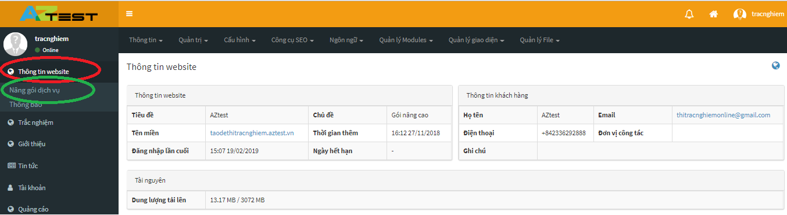
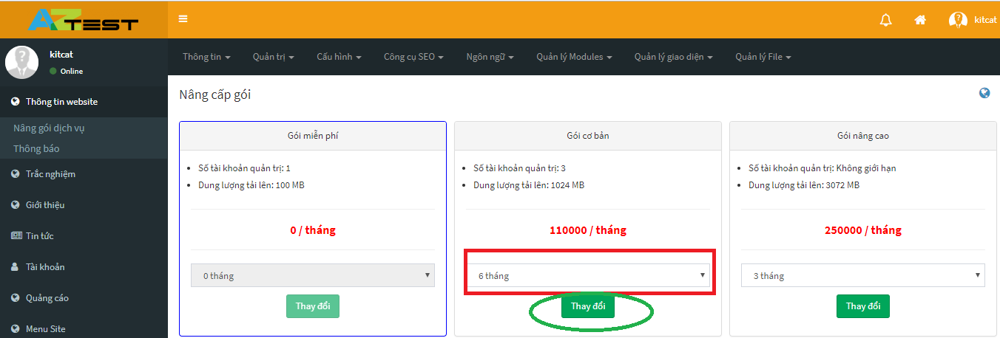
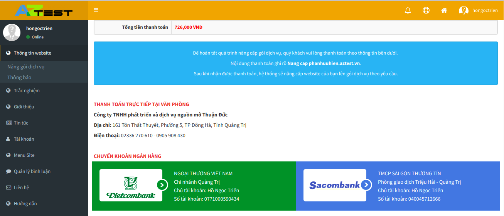

Thông thường khách hàng sẽ lựa chọn sử dụng gói miễn phí để tìm hiểu và làm quen với trang web, tuy nhiên với gói miễn phí khách hàng sẽ bị giới hạn những tính năng mà AZtest muốn đem tới cho người dùng. 

Vì vậy khi đã thực sự tin tưởng và muốn sử dụng hệ thống website tạo đề thi trắc nghiệm AZtest, khách hàng có thể nâng cấp gói dịch vụ của mình để có thể nhận được nhiều tính năng vượt trội hơn. 

Để nâng cấp gói dịch vụ cần làm theo các bước sau đây:

**Bước 1**: Xem chi tiết các gói dịch vụ tại [Bảng giá dịch vụ](https://aztest.vn/bang-gia.html)

**Bước 2**: Đăng nhập vào khu vực quản trị, chọn **Thông tin website (1) -> Nâng gói dịch vụ (2)** 

**Bước 3**: Chọn **Gói dịch vụ muốn nâng cấp -> Chọn Thời gian muốn sử dụng gói dịch vụ (1) -> Thay đổi (2)**

Tại màn hình tiếp theo, hệ thống hiển thị thông tin về gói dịch vụ bạn vừa chọn, và thông tin thanh toán. Tiếp tục thực hiện theo hướng dẫn để hoàn tất quá trình chuyển đổi gói dịch vụ.

> - Bạn chỉ có thể nâng cấp từ gói thấp lên gói cao hơn
- Gói dịch vụ bạn đang sử dụng được tô viền màu xanh
