**Việc thiết lập CẤU HÌNH giúp bạn có thể lựa chọn đối tượng được phép truy cập vào tài khoản AZTest, đồng thời tại đây bạn cũng lựa chọn được cách hiển thị và hình thức hiển thị của các Đề thi trên Trang chủ**.

Để thiết lập cấu hình trên menu **Trắc nghiệm/ Cấu hình** (Menu dọc)

## Nhóm được truy cập
 
Thiết lập [nhóm thành viên](/system/#quan-ly-nhom-thanh-vien) có thể truy cập vào khu vực làm bài thi trên trang chủ.

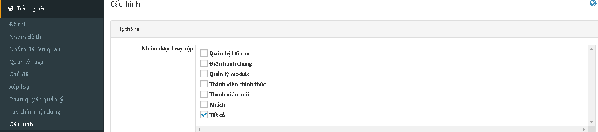

Giải thích trường thông tin: 

| **Trường thông tin** | **Mô tả** |
| -------------------- | --------- |
| **Quản trị tối cao** | Chỉ có người quản trị tối cao được phép truy cập |
| **Điều hành chung** |  |
| **Quản lý Module** |  |
| **Thành viên chính thức** |  |
| **Thành viên mới** |  |
| **Khách** |  |
| **Tất cả** | Nếu tất cả các đối tượng đều được phép truy cập thì tích vào ô **Tất cả** |

Bạn có thể quản lý nhóm thành viên thông qua [Quản lý nhóm thành viên](/system/#quan-ly-nhom-thanh-vien)

Nếu một thành viên **KHÔNG** nằm trong các nhóm cho phép, họ sẽ thấy được thông báo về quyền truy cập.

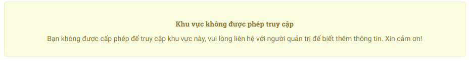

## Hiển thị trên trang chủ

Click vào mũi tên bên phải dòng **Hiển thị trên trang chủ** để lựa chọn cách hiển thị của đề thi trên trang chủ. 

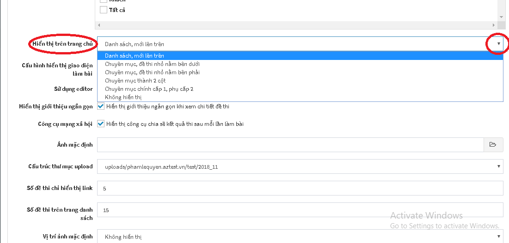

| **Hiển thị lên trang chủ** | **Mô tả** |
| ---------------------------| --------- |
| **Danh sách, mới lên trên** | Các đề thi sẽ được sắp xếp thành một danh sách, những đề thi nào mới sẽ được tự động đẩy lên trên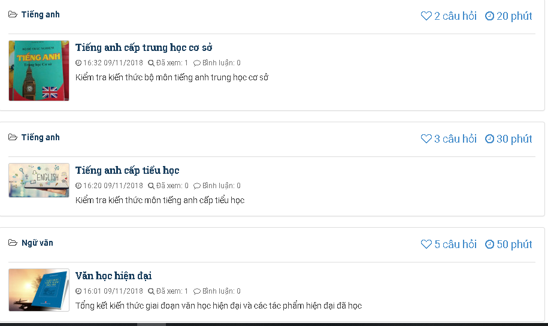 |
| **Chuyên mục, đề thi nhỏ nằm bên dưới** | Các đề thi sẽ được sắp xếp thành các chuyên mục, các đề thi nhỏ sẽ nằm bên dưới chuyên mục |
| **Chuyên mục, đề thi nhỏ nằm bên phải** | Các đề thi sẽ được sắp xếp thành chuyên mục, các đề thi nhỏ thuộc chủ đề sẽ nằm bên phải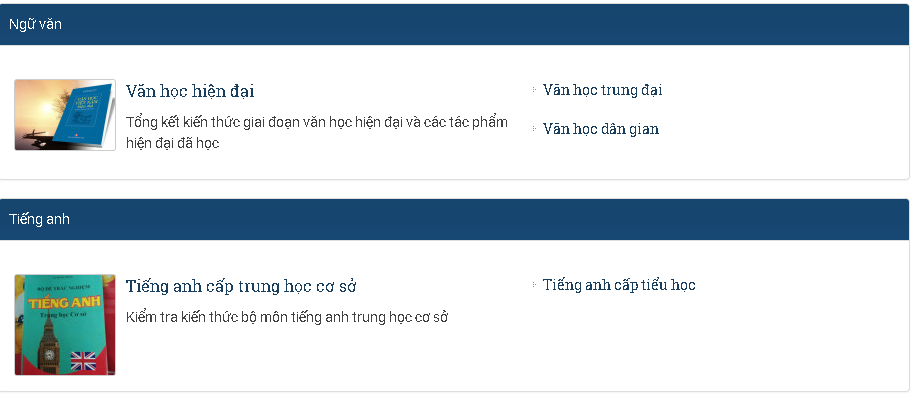 |
| **Chuyên mục thành 2 cột** | Các đề thi sẽ được chia đều thành 2 cột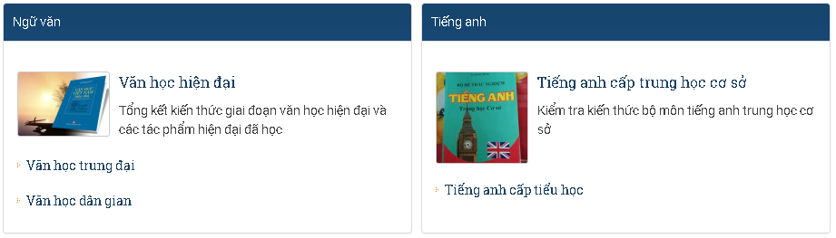 | 
| **Chuyên mục chính cấp 1, phụ cấp 2** | Các đề thi sẽ được chia làm 2 loại chuyên mục: chuyên mục chính và chuyên mục phụ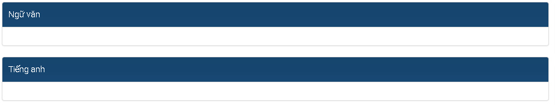 |
| **Không hiển thị** | Trên trang chủ sẽ không hiển thị bất kì một đề thi nào |

## Cấu hình hiển thị giao diện làm bài

Click vào mũi tên bên phải để chọn **Cấu hình hiển thị giao diện làm bài**. 

Giải thích các trường thông tin: 

| **Cấu hình hiển thị giao diện làm bài** | **Mô tả** | 
| --------------------------------------- | --------- | 
| **Hiển thị theo dạng danh sách** |  Các câu hỏi trong đề thi sẽ hiển thị theo dạng danh sách theo số thứ tự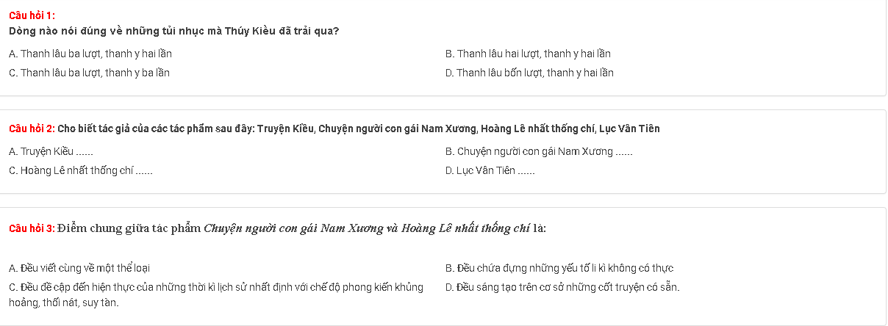 | 
| **Hiển thị từng câu hỏi** | Trên giao diện làm bài sẽ hiển thị từng câu hỏi một, sau khi làm xong một cậu, click Kế tiếp để tiếp tục làm bài 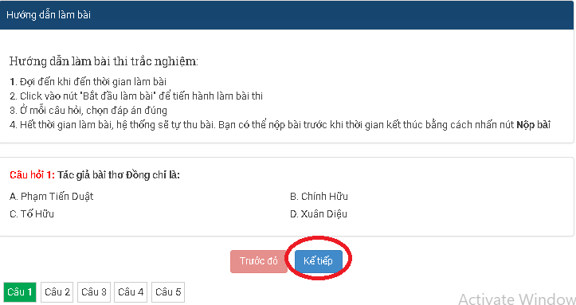 | 

### Thực hiện tương tự các thao tác khác dể thiết lập cấu hình 

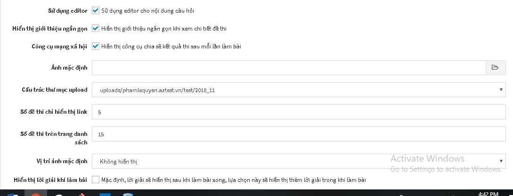

| **Trường thông tin** | **Mô tả** | 
| -------------------- | --------- | 
| **Sử dụng editor** | Trong trường hợp câu hỏi có sử dụng hình ảnh, định dạng văn bản,...thì bạn tích chọn **Sử dụng editor**. Khung soạn thảo sẽ chuyển sang dạng trình soạn thảo văn bản |
| **Hiển thị giới thiệu ngắn gọn** | Nếu bạn muốn hiển thị lời giới thiệu ngắn gọn về đề thi trên trang chủ thì tích chọn **Hiển thị giới thiệu ngắn gọn**<ul><li>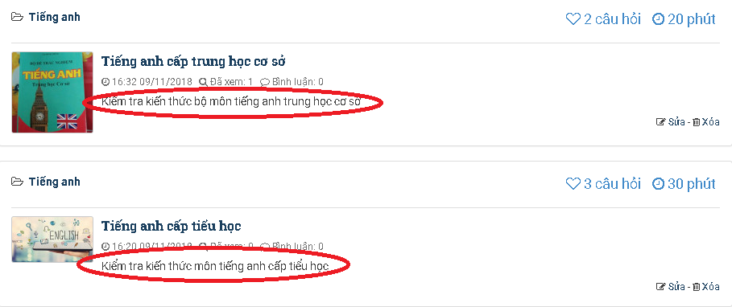 |
| **Công cụ xã hội** | Nếu bạn muốn chia sẻ kết quả sau khi làm bài thi lên các trang mạng xã hội thì tích chọn công cụ xã hội<ul><li>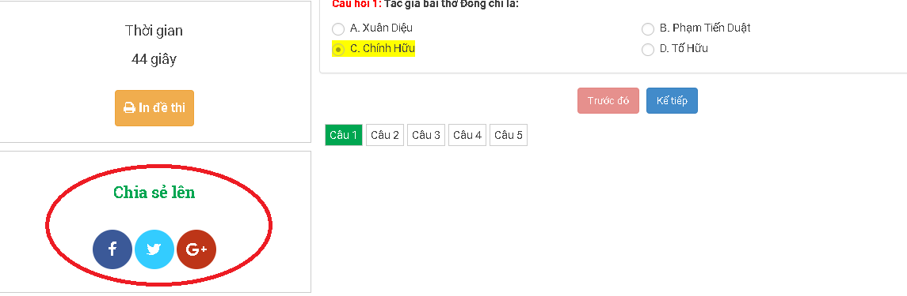 | 
| **Ảnh mặc định** | Lựa chọn ảnh sẽ hiển thị trên danh sách đề thi, trong trường hợp đề thi không có ảnh đại diện (không chọn ảnh đại diện) | 
| **Cấu trúc thư mục upload** | Lựa chọn cấu trúc thư mục lưu các tập tin được tải lên. Việc này giúp bạn quản lý tập tin dễ dàng hơn |
| **Số đề thi chỉ hiển thị link** |  |
| **Số đề thi trên trang danh sách** | Khi số lượng đề thi của bạn nhiều, cần phân trang danh sách đề thi thành nhiều trang. Tại đây bạn có thể thiết lập số lượng đề thi sẽ hiển thị trên một trang |
| **Vị trí ảnh mặc định** | Click vào mũi tên bên phải để lựa chọn vị trí của ảnh mặc định. Bạn có thể lựa chọn: Không hiển thị; Hiển thị bên trái phần mở đầu hoặc hiển thị bên dưới phần mở đầu<ul><li>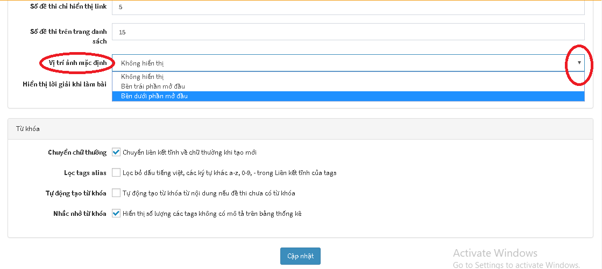 |
|**Hiển thị lời giải khi làm bài** |  Khi tích chọn lời giải sẽ hiện thị trong quá trình làm bài |
| **Từ khóa**| Chuyển chữ thường:<li>Lọc tag alia:<li>Tự động tạo từ khóa:<li>Nhắc nhở từ khóa: |
 
Sau khi đã chọn đầy đủ các mục click **Cập nhật** để hoàn thành. 

Sau khi thực hiện xong bước **Cấu hình**, bạn thực hiện tiếp bước   [**Phân quyền quản lý**](/phan-quyen-quan-ly/)