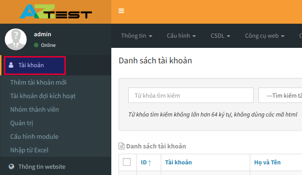
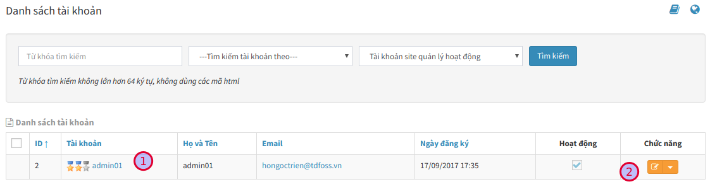
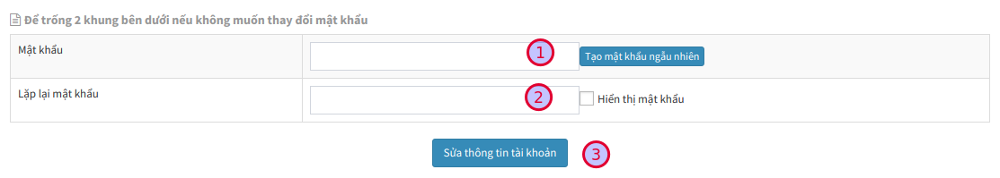

## Khởi tạo website

Bạn có thể khởi tạo website qua các liên kết sau đây:

- Đăng ký gói dùng thử, sau 15 ngày hệ thống tự động chuyển sang gói miễn phí nếu bạn không có động thái chuyển đổi gói dịch vụ. [https://aztest.vn/site/register/](https://aztest.vn/site/register/)
- Lựa chọn gói đăng ký. [https://aztest.vn/bang-so-sanh-tinh-nang.html](https://aztest.vn/bang-so-sanh-tinh-nang.html)

Tiến hành khai báo thông tin vào biểu mẫu, thông tin của bạn cần được bộ phận quản lý nội dung của [AZtest](https://aztest.vn) kiểm duyệt. Thông tin đăng nhập quản trị website sẽ được gửi về email sau khi yêu cầu của bạn được chấp nhận.

## Đăng nhập khu vực quản trị

Sau khi khởi tạo thành công, hệ thống AZtest xét duyệt và gửi email thông báo về cho bạn như hình dưới đây. 

Email này chứa thông tin về website (Tên miền, tiêu đề, tài khoản quản trị,....) và các thông tin cần lưu ý khác. 

Bạn cần lưu ý ghi nhớ **Tên truy cập** và **Mật khẩu** để dùng cho việc xác thực thông tin quản trị bên dưới.

Để đăng nhập vào khu vực quản trị, bạn cần truy cập vào URL đăng nhập khu vực quản trị, URL này có cấu trúc `http://domain/admin/` (với domain là tên miền của bạn). 

Ví dụ: http://huutho.aztest.vn/admin/

> Nội dung email có chứa URL đăng nhập, bạn có thể click vào liên kết đăng nhập quản trị ở nội dung email

Điền thông tin đăng nhập chứa trong email hệ thống AZtest đã gửi về cho bạn để đăng nhập.

	
## Đăng xuất khu vực quản trị

Để đăng xuất khu vực quản trị, chúng ta chọn tài khoản và thoát khỏi tài khoản quản trị.

	

## Thay đổi thông tin tài khoản

- Click vào menu **Tài khoản** (Menu dọc, bên trái màn hình)
- Tại danh sách **Tài khoản** thành viên, click biểu tượng **Sửa** ở cuối tên thành viên bạn muốn sửa đổi thông tin
- Tiến hành điều chỉnh thông tin, sau đó nhấn nút **Lưu** ở cuối trang để kết thúc

## Thay đổi mật khẩu tài khoản quản trị

Sau khi đã được cấp tài khoản đăng nhập và mật khẩu, bạn có thể đổi lại mật khẩu để dễ ghi nhớ trong những lần đăng nhập sau.
 
Các bước đổi mật khẩu:
 
**Bước 1:** Đăng nhập vào tài khoản admin

**Bước 2:** Truy cập menu **Tài khoản** (Menu dọc)

 
**Bước 3:** Trên giao diện danh sách tài khoản hệ thống, tìm đến tài khoản của bạn (1), click biểu tượng **Sửa** (2) ở cuối dòng

**Bước 4:** Trên giao diện thay đổi thông tin tài khoản, bạn thực hiện kéo xuống cuối trang để thay đổi mật khẩu.

 

Bạn điền mật khẩu mới vào ô **Mật khẩu** (1) và **Lặp lại mật khẩu** (2) sao cho khớp với nhau. Sau đó click **Sửa thông tin tài khoản** (3) để hoàn tất. 
 
## Chuyển đổi gói dịch vụ

Khi muốn chuyển đổi gói dịch vụ, vui lòng liên hệ với AZtest tại [đây](https://aztest.vn/contact/) để được hỗ trợ. Sau khi nhận yêu cầu, bộ phận chăm sóc khách hàng của AZtest sẽ liên hệ để thực hiện một số thủ tục, website của bạn sẽ được tự động chuyển đổi gói dịch vụ sau khi giao dịch thành công.