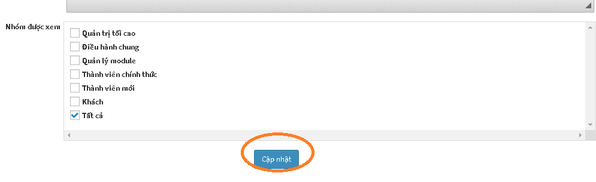
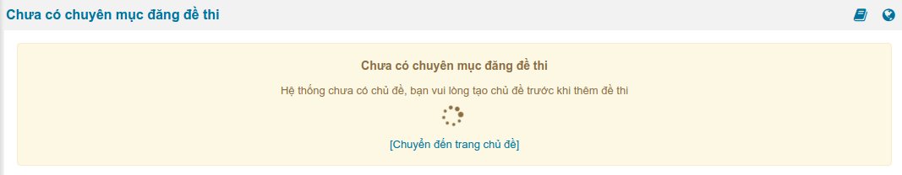

## Thiết lập chủ đề

**CHỦ ĐỀ là đơn vị giúp phân loại đề thi trong hệ thống AZtest. Người dùng có thể tạo được nhiều đề thi khác nhau trong cùng một chủ để. Điều này giúp phân loại được dễ dàng giữa các nhóm chủ đề như bộ môn, kỳ thi, lớp học...**

   <iframe width="659" height="371" src="https://www.youtube.com/embed/9M8MkCGZ0Ew" frameborder="0" allow="accelerometer; autoplay; encrypted-media; gyroscope; picture-in-picture" allowfullscreen></iframe>

Video hướng dẫn Tạo chủ đề trong AZtest

> **Lưu ý**: Bạn cần có ít nhất 01 chủ đề trước khi bước vào tạo một đề thi trắc nghiệm hoàn chỉnh.

### Thêm chủ đề

Tại khu vực **Thêm Chủ đề**:

Nhập đầy đủ thông tin bắt buộc (trường có dấu sao):

| Trường thông tin | Mô tả | 
| ---------------- | ----- | 
|**Tiêu đề (1)** | Nhập tên cho chủ đề. Ví dụ: Đề thi toán, đề thi lý, đề thi hóa,... |
|**Liên kết tĩnh (2)** | Cấu hình liên kết URL cho tiêu đề, phần này sẽ tự động tạo sau khi nhập xong Tiêu đề, bạn có thể sửa lại hoặc không. |
|**Thuộc chủ đề (3)** | Chọn chủ đề trực thuộc (Bạn có thể thêm chủ đề con của một chủ đề bằng cách chọn chủ đề trực thuộc) |
|**Title tag (4)** | (SEO) Nhập thẻ tiêu đề |
|**Mô tả (5)** | Mô tả ngắn gọn về chủ đề |
|**Hình ảnh (6)** | Chọn hình ảnh minh họa cho chủ đề. Thêm hình ảnh tại mục (7), cách thêm hình ảnh minh họa chi tiết xem lại "Hướng dẫn thêm hình ảnh minh họa cho đề thi". |
|**Nội dung (7)** | Tải hình lên |
|**Từ khóa (8)** | Nhập từ khóa tìm kiếm cho chủ đề |

Sau khi nhập thông tin, nhấn nút **Cập nhật** để tiến hành thêm. 

Nếu thêm thành công, chủ đề mới sẽ xuất hiện trong danh sách chủ đề.

### Sửa chủ đề

- Tại danh sách các chủ đề, click nút **Sửa** ở cuối dòng

- Hành động sửa cũng như hành động [Thêm chủ đề](/test/#them-chu-e)

### Xóa chủ đề

- Tại danh sách các chủ đề, click nút **Xóa** ở cuối dòng

- **Xóa Chủ đề** chính cũng đồng thời xóa chủ đề con của nó
> **Lưu ý:** Xóa chủ đề sẽ xóa hết các dữ liệu thuộc chủ đề đó (Đề thi, lịch sử thi,...). Bạn cần chuyển dữ liệu cần thiết sang chủ đề khác trước khi quyết định xóa 

## Quản lý chủ đề

Trong Module **Trắc nghiệm**, bạn chọn **Chủ đề** (menu dọc)

Giải thích các Trường thông tin:

| Trường thông tin | Mô tả |
| ---------------- | ----- |
|**Tiêu đề** | Truy cập đến danh sách chủ đề con | 
|**Hiển thị trang chủ** | Cấu hình cho phép Hiển thị / Không hiển thị chủ đề (và các đề thi thuộc chủ đề) lên trang chủ của website |
|**Số liên kết** | Quy định số đề thi cùng chủ đề được gợi ý khi xem một đề thi bất kỳ |
|**Phương án hiển thị** | Quy định giao diện hiển thị đề thi khi xem chủ đề |
|**Thống kê điểm cao** | Quy định giao diện hiển thị đề thi khi xem chủ đề | 

*Sau khi thực hiện xong bước **Tạo chủ đề**, bạn thực hiện tiếp bước  [**Xếp loại**](/xep-loai/)*

**Lưu ý: Với những trang web mới khởi tạo nếu người dùng chưa tạo chủ đề, khi tạo đề thi hệ thống sẽ thông báo và chuyển sang trang quản lý chủ đề.
Lúc này người dùng phải tạo một chủ đề thì mới có thể tạo được đề thi. Người dùng có thể tạo được nhiều đề thi khác nhau trong cùng một chủ đề. Điều này giúp phân loại được dễ dàng giữa các nhóm chủ đề như bộ môn, kỳ thi, lớp học…

