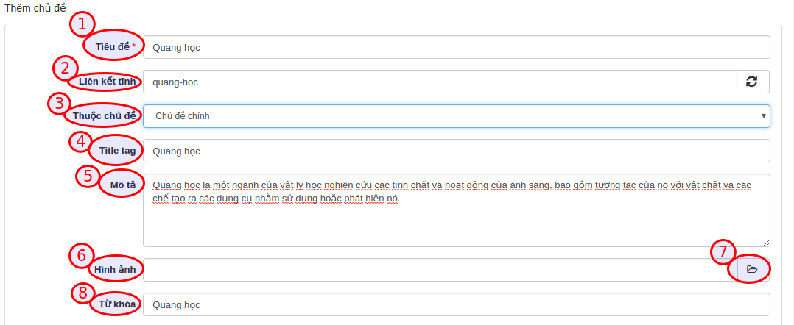

## Thiết lập chủ đề

**Chủ đề** là đơn vị giúp phân loại đề thi trong hệ thống AZtest. Qua chủ đề, chúng ta có thể thiết lập các thuộc tính (cấu hình) riêng cho các đề thi nằm cùng một chủ đề. 

Bạn cần tạo ít nhất 01 chủ đề trước khi thực hiện các bước tiếp theo.

Truy cập **Trắc nghiệm / Chủ đề** (menu dọc)

Trên danh sách chủ đề, bạn có thể:

| Trường thông tin | Mô tả |
| ---------------- | ----- |
|**Tiêu đề** | Truy cập đến danh sách chủ đề con | 
|**Hiển thị trang chủ** | Cấu hình cho phép Hiển thị / Không hiển thị chủ đề (và các đề thi thuộc chủ đề) lên trang chủ của website |
|**Số liên kết** | Quy định số đề thi cùng chủ đề được gợi ý khi xem một đề thi bất kỳ |
|**Phương án hiển thị** | Quy định giao diện hiển thị đề thi khi xem chủ đề |
|**Thống kê điểm cao** | Quy định giao diện hiển thị đề thi khi xem chủ đề | 

## Quản lý chủ đề

### Thêm chủ đề

Tại khu vực thêm chủ đề, nhập đầy đủ thông tin bắt buộc (trường có dấu sao):

| Trường thông tin | Mô tả | 
| ---------------- | ----- | 
|**Tiêu đề (1)** | Nhập tên cho chủ đề. Ví dụ: Đề thi toán, đề thi lý, đề thi hóa,... |
|**Liên kết tĩnh (2)** | Phần này sẽ tự động tạo sau khi nhập xong Tiêu đề, bạn có thể sửa lại hoặc không (không được để trống) |
|**Thuộc chủ đề (3)** | Chọn chủ đề trực thuộc (Bạn có thể thêm chủ đề con của một chủ đề bằng cách chọn chủ đề trực thuộc) |
|**Title tag (4)** | (SEO) Nhập thẻ tiêu đề |
|**Mô tả (5)** | Mô tả ngắn gọn về chủ đề |
|**Hình ảnh (6)** | Chọn hình ảnh minh họa cho chủ đề |
|**Từ khóa (8)** | Nhập từ khóa tìm kiếm cho chủ đề |

Sau khi nhập thông tin, nhấn nút **Cập nhật** để tiến hành thêm. Nếu thêm thành công, chủ đề mới sẽ xuất hiện trong danh sách chủ đề.

### Sửa chủ đề

- Tại danh sách các chủ đề, click nút **Sửa** ở cuối dòng
- Hành động sửa cũng như hành động [Thêm chủ đề](/test/#them-chu-e)

### Xóa chủ đề

- Tại danh sách các chủ đề, click nút **Xóa** ở cuối dòng
- Xóa chủ đề cha, cũng đồng thời xóa chủ đề con của nó
- Xóa chủ đề sẽ xóa hết các dữ liệu thuộc chủ đề đó (Đề thi, lịch sử thi,...). Bạn cần chuyển dữ liệu cần thiết sang chủ đề khác trước khi quyết định xóa 

Sau khi thực hiện xong bước **Tạo chủ đề**, bạn thực hiện tiếp bước  [**Xếp loại**](/xep-loai/)