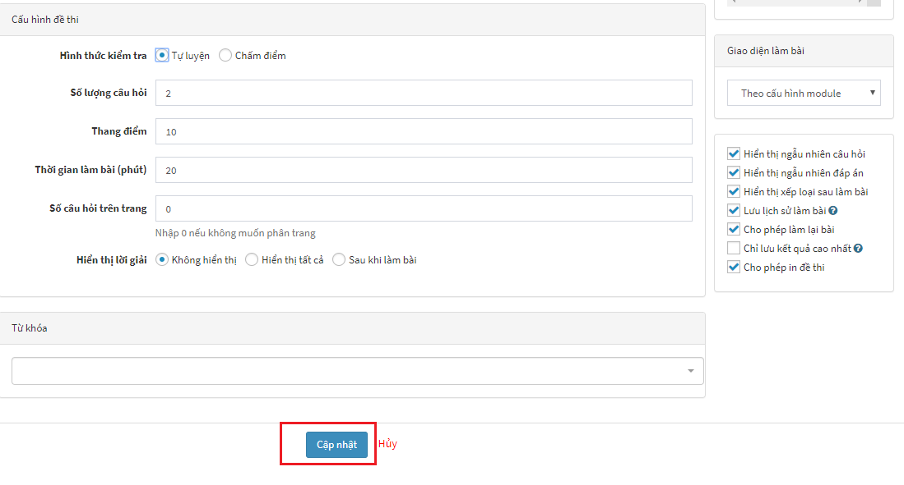

## Thiết lập đề thi

**Việc Thiết lập đề thi là một khâu quan trọng cho phép chúng ta có thể Tạo đề thi mới, Quản lý câu hỏi, Đáp án và Lời giải.**

	<iframe width="875" height="398" src="https://www.youtube.com/embed/zkL39njETgA" 	frameborder="0" allow="accelerometer; autoplay; encrypted-media; gyroscope; picture-in-picture" allowfullscreen></iframe>

 

Video hướng dẫn thiết lập đề thi

### TẠO ĐỀ THI MỚI

Bạn cần [đăng nhập vào khu vực quản trị](http://localhost:8000/start/#ang-nhap-khu-vuc-quan-tri) trước khi sử dụng tính năng này. Thông tin tài khoản đã được gửi qua email khi bạn đăng ký dịch vụ.

**BƯỚC 1**: Trên giao diện quản trị, truy cập **Trắc nghiệm** >>> Chọn Menu **Đề thi** (1) >>> Chọn **Thêm đề thi** (2)

**BƯỚC 2**: Cần nhập đầy đủ các trường có gắn dấu sao (*) ở cuối trước khi nhấn **Cập nhật**

>***Lưu ý**: Với các đề thi thuộc phân môn tự nhiên, nếu trong nội dung câu hỏi có chứa các công thức toán học, bạn có thể xem thêm chi tiết soạn công thức toán học tại [**Nhập công thức toán học**](/nhap-cong-thuc-toan-hoc/).*

Giải thích các trường thông tin:

| Trường thông tin | Mô tả |
|------------------|-------|
|**Tên gọi đề thi (1)**| Nhập tiêu đề cho đề thi |
|**Liên kết tĩnh (2)**| Cấu hình liên kết URL cho đề thi, phần này sẽ tự động tạo sau khi nhập xong Tên gọi đề thi, bạn có thể sửa lại hoặc không |
|**Chủ đề (3)**| Chọn chủ đề cho đề thi. (Cần có ít nhất chủ đề trước khi thêm đề thi) |
|**Dòng sự kiện (4)**| Chọn thêm đề thi vào nhóm đề thi liên quan. Khi bạn click, các nhóm đề thi liên quan trước đó sẽ xuất hiện, bạn chọn nhóm đề thi liên quan muốn liên kết. |
|**Hình ảnh (5)**| Chọn ảnh đại diện cho đề thi (hiển thị trên danh sách) |
|**Giới thiệu (6)**| Mô tả ngắn gọn về nội dung đề thi |
|**Nội dung (7)**| Nhập nội dung mô tả chi tiết cho đề thi |
|**Nhóm tham gia thi (8)**| Chọn nhóm thành viên được phép thực hiện đề thi này |
|**Nhóm được bình luận (9)**| Nhóm thành viên được phép bình luận trong trang xem chi tiết đề thi | 
|**Nhóm xem đáp án sau bài làm (10)**| Nhóm thành viên được phép xem đáp án sau khi làm bài. |
|**Nguồn**| Trong quá trình biên soạn các bộ đề thi trắc nghiệm cho học sinh tự luyện hoặc tổ chức thi chấm điểm, thầy cô có thể tham khảo các nguồn để thi hay từ các đồng nghiệp hoặc các trang đề thi. Để đảm bảo tính bản quyền, AZtest đã cung cấp thêm tính năng thêm thông tin nguồn đề thi ([**Xem thêm**](/huong-dan-mo-rong/quan-ly-nguon-de-thi)) |

**BƯỚC 3**: Nhập tương tự cho các thông tin tiếp theo

Giải thích các trường thông tin:

| Trường thông tin | Mô tả | 
| -----------------| ------| 
| **Chọn hình thức kiểm tra (1)**| <ul><li>Tự luyện: Đề thi cho phép một thành viên thi nhiều lượt, mỗi lượt thi hệ thống sẽ tự động thay đổi vị trí các câu hỏi và đáp án.Mỗi lượt thi đều chấm điểm <li>Chấm điểm: Đề thi chỉ cho phép mỗi thành viên thi một lượt và được chấm điểm. Phương án này phù hợp với việc tổ chức các kỳ thi để lấy kết quả thi.|
|**Số lượng câu hỏi (2)** | Nhập số lượng câu hỏi của đề thi |
|**Thang điểm (3)** | Nhập thang điểm của đề thi |
|**Thời gian làm bài (4)** | Nhập thời gian làm bài của đề thi, thời gian tính bằng đơn vị phút. |
|**Số câu hỏi trên trang (5)** | Nhập số câu hỏi hiển thị trên một trang, nếu không muốn phân trang thì nhập 0, hệ thống sẽ tự động phân trang |
|**Phương thức nhập câu hỏi (6)** | <ul><li>Nhập câu hỏi mới: Sau khi thêm đề thi thành công, hệ thống sẽ chuyển bạn đến giao diện nhập nội dung câu hỏi<li>Nhập từ Microsoft Word: Sau khi thêm đề thi thành công, hệ thống sẽ chuyển bạn đến giao diện nhập nội dung từ file Word </ul>.Xem thêm  [**Nhập câu hỏi từ word**](/nhap-cau-hoi-tu-word/)|
|**Tích chọn các tính năng mở rộng cho đề thi (7)** | <ul><li>Hiển thị ngẫu nhiên câu hỏi và đáp án: Sau mỗi lượt thi, các câu hỏi sẽ được hiển thị ngẫu nhiên, các đáp án sẽ ngẫu nhiên thay đổi vị trí.<li>Hiển thị xếp loại sau làm bài: Sau khi nộp bài, hệ thống căn cứ vào kết quả và xếp loại bài thi của bạn. Bạn cần cấu hình xếp loại để hiển thị đúng tiêu chí này.<li>Lưu lịch sử làm bài: Hệ thống tự động lưu lại lịch sử thi của thành viên<li>Cho phép làm lại bài: Cho phép thành viên có thể làm lại bài thi<li>Cho phép in đề: Hệ thống sẽ in đề thi trực tiếp.|
|**Cập nhật (8)** | Nhấn chọn Cập nhật (8) để hoàn tất. |

Sau khi điền đầy đủ các trường thông tin cần thiết, nhấn **Cập nhật** để thêm đề thi. Dựa vào lựa chọn **Phương thức nhập câu hỏi (6)**, hệ thống sẽ chuyển bạn đến trang tương ứng để tiếp tục nhập câu hỏi cho đề thi.

### QUẢN LÝ CÂU HỎI
Sau khi **Tạo Đề thi mới**, chúng ta tiếp tục đến bước **Quản lý Câu hỏi** thông qua việc hoàn thiện các bước Thêm câu hỏi, Đáp án và Lời giải.
####Thêm câu hỏi
Sau khi nhấn **Cập nhật** ở bước **Tạo Đề thi mới**, giao diện trang xuất hiện câu hỏi:

Giải thích các trường thông tin:

| Trường thông tin | Mô tả |
| -----------------| ------| 
|**Loại câu hỏi (1)** | Nhấn chọn loại câu hỏi <ul><li>**Câu hỏi trắc nghiệm**: Loại câu hỏi với các đáp án cho sẵn, học sinh chọn ra các đáp án đúng, mỗi câu hỏi có thể có một hoặc nhiều đáp án đúng .<li>**Câu hỏi điền vào ô trống**: Loại câu hỏi yêu cầu điền vào ô trống câu trả lời đúng tương ứng với dữ liệu đã cho trong câu hỏi.<li>**Câu hỏi chung**: Loại câu hỏi gồm câu hỏi và đoạn văn bản đọc hiểu. Học sinh dựa vào đoạn văn bản đề chọn câu trả lời cho câu hỏi.|
|**Tiêu đề (2)** | Nhập tiêu đề chính là nội dung câu hỏi. |
|**Danh sách câu hỏi (3)** | Danh sách các câu hỏi của đề thi |
|**Câu hỏi màu xanh (4)** | Câu hỏi đã nhập nội dung sẽ có màu xanh (4) |
|**Câu hỏi màu đỏ (5)** | Câu chưa nhập nội dung có màu đỏ. Các câu hỏi này có thể xóa (5) |
|**Tính năng làm rỗng hoặc xóa** | Với những nội dung câu hỏi bị trùng lặp hoặc không cần thiết nữa thì bạn có thể sử dụng tính năng cho phép làm rỗng nội dung câu hỏi hoặc xóa câu hỏi khỏi danh sách để thay thế những nội dung câu hỏi mới .|

####Đáp án
Sau khi **Thêm Câu hỏi** chúng ta tiếp tục thêm **Đáp án** cho câu hỏi đã tạo:

Giải thích các trường thông tin:

| Trường thông tin | Mô tả |
| -----------------| ------|
|**Trình bày đáp án (1)** | <ul><li>Chia đều hai cột: Các đáp án sẽ được chia đều thành 2 cột.<li>Các đáp án trên một hàng: Tất cả các đáp án của câu hỏi sẽ được trình bày trên một hàng.<li>Mỗi đáp án một hàng: Mỗi đáp án của câu hỏi nằm tách biệt trên một hàng. |
|**Sử dụng editor cho nội dung đáp án (2)** | Trong trường hợp đáp án câu hỏi có sử dụng hình ảnh, định dạng văn bản,...thì bạn tích chọn Sử dụng editor cho nội dung đáp án (2), khung soạn thảo sẽ được chuyển sang dạng trình soạn thảo văn vản. |
|**Thêm đáp án (3)** | Sau khi nhập nội dung đáp án A, bạn nhấn chọn thêm đáp án để thêm đáp án B, C.... Hệ thống không giới hạn số lượng các đáp án được tạo. |
|**Chọn đáp án đúng (4)** | Bạn cần chọn ít nhất một đáp án đúng (4) cho câu hỏi, một câu hỏi có thể có nhiều đáp án đúng. |
|**Cập nhật (5)** | Nhấn nút Cập nhật (5) để lưu câu hỏi. Bạn sẽ được tự động chuyển sang câu hỏi tiếp theo để tiếp tục soạn thảo. |

Quá trình này lặp đi lặp lại cho các câu hỏi và kết thúc sau khi hoàn thành câu hỏi cuối cùng.

> **Lưu ý:** Đề thi được xem là hợp lệ (có thể làm bài) khi số lượng câu hỏi nhập vào bằng với số lượng câu hỏi của đề thi.
####Lời giải

**Lời giải là phần thông tin về cách giải đề hoặc các thông tin liên quan đến đáp án để học sinh tham khảo. Nhờ phần lời giải học sinh có thể bổ sung thêm những phần kiến thức chưa biết.**

Trong quá trình soạn đề thi, giáo viên có thể lựa chọn cho phép hiển thị lời giải hoặc không. 

 

Tại mục **Hiển thị lời giải**, giáo viên có thể lựa chọn: 

| Trường thông tin | Mô tả |
| ---------------- | ----- |
| **Không hiển thị** | Lời giải sẽ không hiển thị |
| **Hiển thị tất cả** | Lời giải sẽ hiển thị ở cả trong quá trình làm bài và sau khi làm bài |
| **Sau khi làm bài** | Lời giải sẽ hiển thị sau khi hết thời gian làm bài (có thể áp dụng cho dạng đề thi **Chấm điểm**) |

Phần cuối cùng trong bước **Thiết lập Đề thi** là phần để bạn có thể điền thông tin **Lời giải**:

- **Đối với các phân môn Tự nhiên**: Sử dụng để ghi lời giải (nếu có) của câu hỏi. Người giải đề sẽ tham khảo sau khi trả lời câu hỏi để đối chiếu với bài làm.
- **Đối với các phân môn Xã hội**: Sử dụng để cung cấp thêm thông tin (nếu có) liên quan đến đáp án đúng.

## Quản lý đề thi

Sau khi thiết lập xong Đề thi, để **Quản lý Đề thi**, bạn chọn menu **Đề thi**

Các đề thi đã có xuất hiện với các thông tin:

Giải thích các trường thông tin:

| Trường thông tin | Mô tả |
| -----------------| ----- |
|**Tìm kiếm (1)** | Nhập từ khóa và chủ chủ đề tìm kiếm một đề thi trong kho đề thi của bạn |
|**Tên gọi đề thi (2)** | Tên gọi của đề thi mà bạn đã nhập trước đó | 
|**Hình thức kiểm tra (3)** | Hình thức kiểm tra của đề thi tương ứng |
|**Số câu hỏi (4)** | Số lượng câu hỏi trên đề thi |
|**Thang điểm (5)** | Thang điểm của đề thi |
|**Thời gian làm bài (6)** | Thời gian làm bài của đề thi |
|**Hoạt động (7)** | Đề thi vấn được sử dụng |
|**Quản lý (8)** | Cho biết số câu hỏi của đề và lịch sử thi của đề tương ứng |
|**Sửa & xóa đề thi (9)** | Liên kết sửa, xóa đề thi |

Tiếp theo

- [Cấu hình](/cau-hinh/)