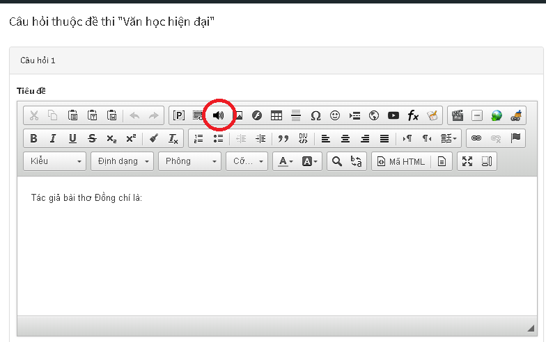
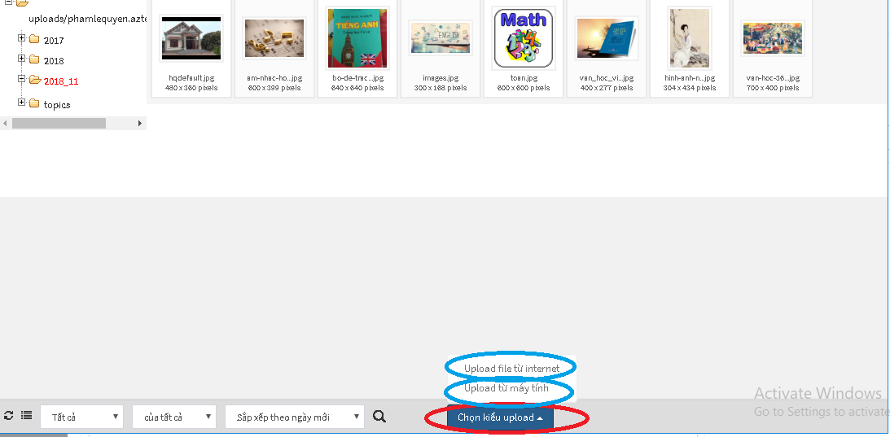
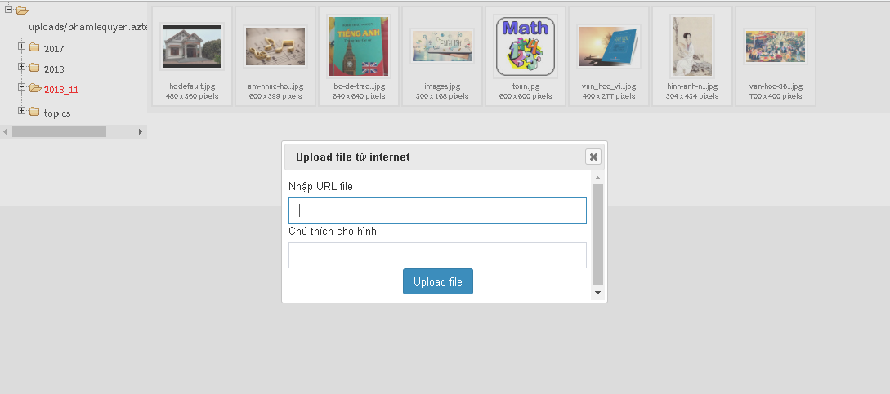

Với những đề thi có câu hỏi chứa nội dung liên quan đến âm thanh, bạn phải thực hiện các thao tác sau đây: 

**Bước 1:** Click icon **Âm thanh** trên công cụ soạn thảo

 

**Bước 2:** Cửa sổ file hiện lên như hình dưới, chọn **Duyệt máy chủ** để mở cửa sổ quản lý file

 

Sau đó sẽ hiển thị ra cửa sổ dưới đây (cửa sổ quản lý file)

 

**Bước 3:** Click Chọn kiểu upload sẽ hiển thị ra các lựa chọn: 

- **Upload file từ Internet**: Sử dụng tùy chọn này khi bạn có một tập tin âm thanh được lưu trữ trên internet (Ví dụ: aztest.vn/media/test01.mp3) Nhập URL và chú thích của file âm thanh, sau đó click **Upload file**

 
- **Upload  file  từ máy tính:** Sử dụng tùy chọn này khi file âm thanh được lưu trữ tại máy tính của bạn

Xem thêm  [Quản lý file](/system/#quan-ly-file)

Sau khi upload  âm thanh lên thành công cần click đúp chuột vào âm thanh để đưa âm thanh và nội dung soạn thảo. 

 