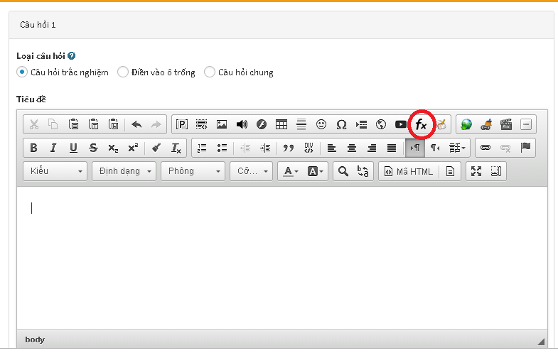
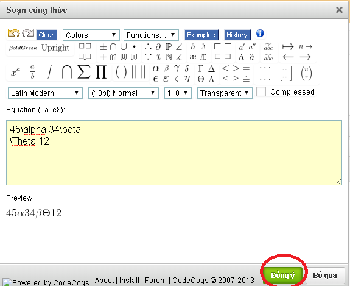

Với các phân môn tự nhiên, nếu trong nội dung câu hỏi có chứa các công thức toán học bạn thực hiện các thao tác sau đây:

	<iframe width="875" height="398" src="https://www.youtube.com/embed/M2GxebKuHNo" 	frameborder="0" allow="accelerometer; autoplay; encrypted-media; gyroscope; picture-in-picture" allowfullscreen></iframe>

 

Video hướng dẫn chèn công thức trong nội dung

Bạn có thể sử dụng công cụ **Chèn công thức toán học** trên trình soạn thảo như hình dưới đây:

 

Lúc này sẽ hiển thị ra cửa sổ để **Soạn công thức toán** như hình dưới:

Sau khi soạn thảo công thức toán bạn click  **Đồng ý** để hoàn tất. 

Xem thêm chi tiết cách tạo [**đề thi**](/de-thi/)
