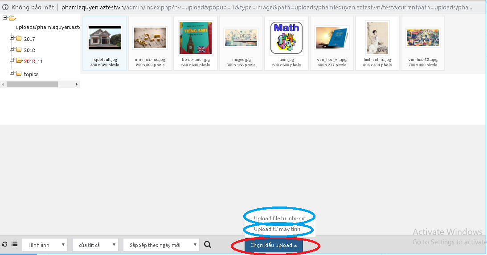
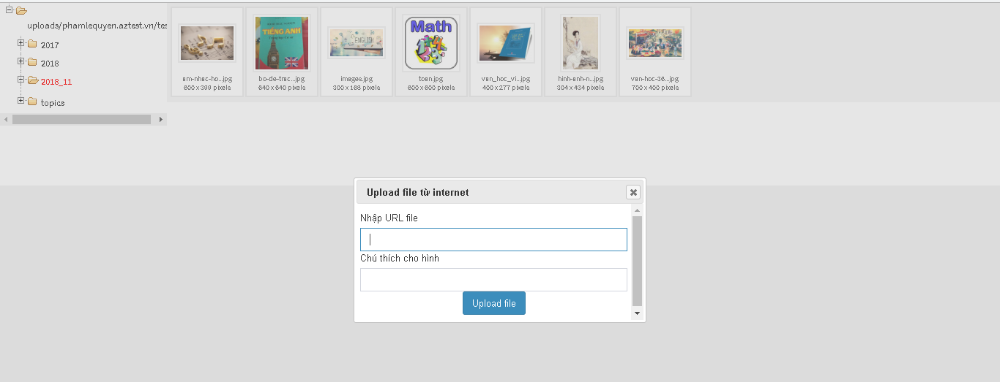

Với những đề thi có các câu hỏi chứa nội dung liên quan đến hình ảnh, bạn phải thực hiện các thao tác sau đây:
 
**Bước 1:**  Click icon **Hình ảnh** trên công cụ soạn thảo

**Bước 2:** Cửa sổ file hiện lên như hình dưới, click chọn **Duyệt máy chủ**  

 Sau đó sẽ hiển thị ra cửa sổ dưới đây: 

**Bước 3:** Click **Chọn kiểu upload** sẽ hiển thị ra các lựa chọn: 

- **Upload file từ Internet:** khi chọn upload  hình trên internet sẽ hiển thị ra cửa sổ dưới đây: 

Trong đó, bạn phải nhập URL và chú thích của hình ảnh, sau đó click Upload file

- **Upload file từ máy tính:** Cho phép upload  những hình ảnh có sẵn trong máy tính của bạn. 

Sau khi upload  ảnh lên thành công thì cần click đúp chuột vào hình ảnh để đưa ảnh vào nội dung soạn thảo.

Xem thêm  [**Quản lý file**](/quan-ly-file/)

