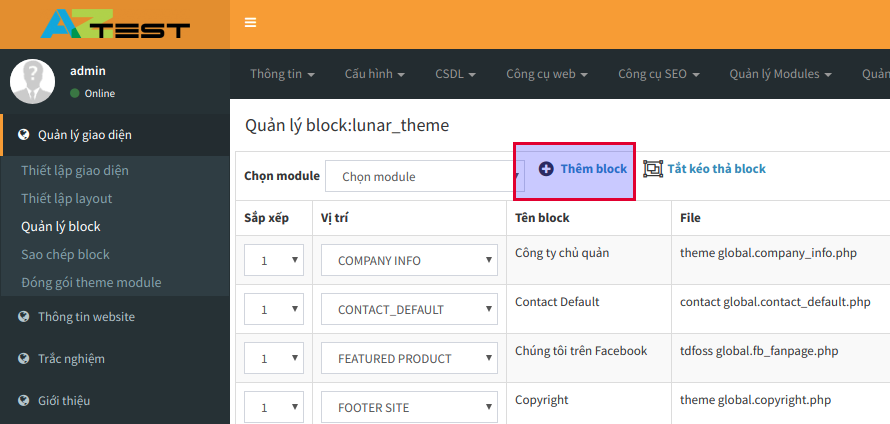

Với AZtest, người quản trị có thể chèn mã theo dõi **Google analytics** mà không cần phải can thiệp vào mã nguồn website. Trong tài liệu này, chúng tôi sẽ không đi hướng dẫn chi tiết về cách thức đăng ký Google analytics, bạn có thể tìm thấy hướng dẫn trên internet. Các bước thực hiện bên dưới đây chỉ sử dụng khi bạn đã có mã theo dõi sau khi đã đăng ký Google analytics.

### Các bước thực hiện

1, Đăng nhập khu vực quản trị (doimain/admin/index.php)

2, Truy cập **Quản lý giao diện => Quản lý block**

3, Click **Thêm block**

4, Thiết lập như hình (Chỉ cần quan tâm ở những nơi được đánh dấu)

Nhấn **Chấp nhận** (5) để hoàn tất