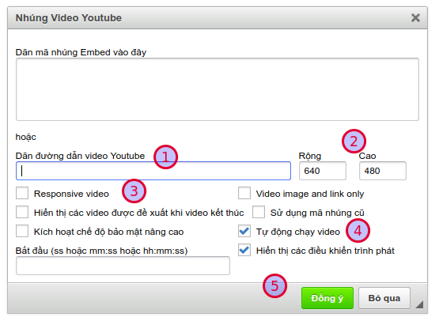
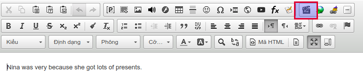
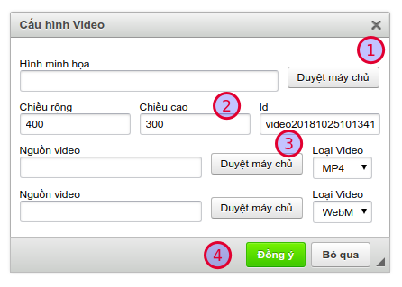

## Nhúng video từ youtube

AZtest khuyến khích việc sử dụng youtube làm nơi lưu trữ, chia sẽ video, tiết kiệm dung lượng cho hệ thống.

https://youtu.be/udnAY5_mxFI
	<iframe width="875" height="398" src="https://www.youtube.com/embed/udnAY5_mxFI" 	frameborder="0" allow="accelerometer; autoplay; encrypted-media; gyroscope; picture-in-picture" allowfullscreen></iframe>

 

Video hướng dẫn chèn video trong nội dung

Khi đã có video từ Youtube, bạn cần thực hiện các bước sau:

**Bước 1:** Sao chép đường dẫn video. Ví dụ: `https://www.youtube.com/watch?v=bqL76wUDkCI&t=72s`

**Bước 2:** Click icon **Embed Youtube Video** trên trình soạn thảo

**Bước 3:** Trong cửa sổ này, bạn tiến hành dán (paste) đường dẫn video đã chuẩn bị ở bước 1 vào ô **Dãn đường dẫn video Youtube** (1)

Cũng trong cửa sổ này, bạn có thể:

- Thiết lập chiều rộng, cao của video khi phát (2)
- Responsive video (3): cho phép tự động thay đổi kích thước video phù hợp với các kích cỡ màn hình khác nhau
- Tự động phát video (4): Video sẽ tự động phát sau khi tải trang

Cuối cùng, click **Đồng ý** để lưu các thiết lập 

## Chèn video từ máy tính

Trong trường hợp bạn đã chuẩn bị file video trên máy tính và không muốn upload video lên các kênh chia sẽ miễn phí, bạn hoàn toàn có thể upload file của bạn lên hệ thống. 

> Hỗ trợ định dạng mp4

**Bước 1:** Click vào icon **Video** trên trình soạn thảo

**Bước 2:** Trong cửa số này, bạn cần thực hiện một số thao tác

- Hình minh họa (1): Chọn ảnh minh họa sẽ hiển thị trước khi phát video
- Thiết lập chiều rộng, cao của video khi phát (2)
- Chọn tập tin video từ máy (3). Xem thêm: [Quản lý file](/system/#quan-ly-file)

Cuối cùng, click **Đồng ý** để lưu các thiết lập 