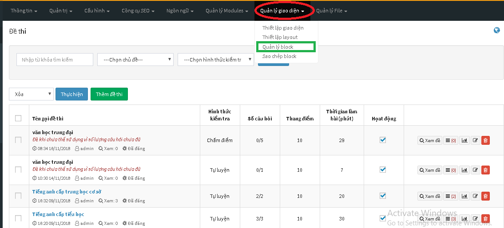
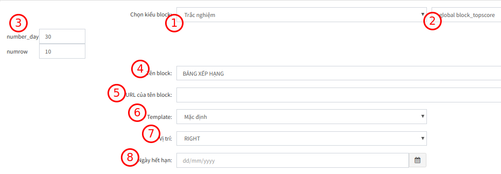
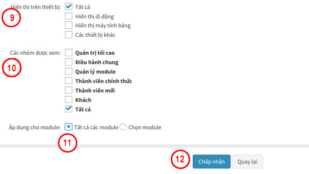
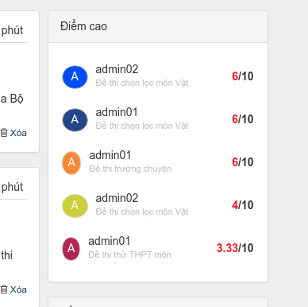

Thực hiện kích hoạt tính năng thống kê này theo các bước bên dưới:

	<iframe width="875" height="398" src="https://www.youtube.com/embed/dOYAINNSpsE" 	frameborder="0" allow="accelerometer; autoplay; encrypted-media; gyroscope; picture-in-picture" allowfullscreen></iframe>

 

Video hướng dẫn hiển thị bảng thống kê thành viên điểm cao

**BƯỚC 1**: Đăng nhập quản trị

Tiến hành truy cập khu vực quản trị theo thông tin đã có, tại đường dẫn domain/admin/index.php (với domain là tên miền của bạn)
 
**BƯỚC 2**: Kích hoạt block topscore

- Từ giao diện chính quản trị, click vào menu Quản lý giao diện (1) => Quản lý block (2)

  

- Nhấn Thêm block (3). Lúc này, một cửa sổ mới sẽ hiện lên:

 

Bạn cần quan tâm tới những thông tin này:

 

| **Trường thông tin** | **Mô tả** |
| -------------------- | --------- |
| **Kiểu block** (1) | Trắc nghiệm => global.block_topscore.php (2) |
| **Number_day** (3) | Là số ngày giới hạn thống kê **Numrow** (3): Số lượng thành viên hiển thị trong danh sác |
| **Tên block** (4) | Đặt tên hiển thị cho khối này, VD "Thành viên có điểm cao" |
| **URL của block** (5) | Bạn có thể bỏ qua bước này.  |
| **Template** (6) | Chọn **Mặc định** |
| **vị trí**(7) | Chọn khối bạn muốn hiển thị trên giao diện |
| **Ngày hết hạn** (8) | Bạn có thể bỏ qua bước này nếu muốn bảng thống kê thành viên điểm cao tồn tại vĩnh viển. |

 

| **Trường thông tin** | **Mô tả** |
| ---------------------| --------- |
| **Hiển thị trên thiết bị** (9) | Bạn chọn thiết bị mà bảng thống kê thành viên điểm cao được phép hiển thị |
| **Các nhóm được xem** (10) | Bạn chọn nhóm được xem bảng thống kê thành viên điểm cao |
|  **Áp dụng cho module** (11) |  Tích vào **Tất cả các module** |

Sau khi hoàn thành các bước trên nhấn **Chấp nhận** (12) để hoàn tất

**BƯỚC 3**: Hiển thị block

Sau khi thêm, bạn trở lại giao diện chính ở khu vực site, sẽ thấy sự xuất hiện của block thành viên điểm cao

 

