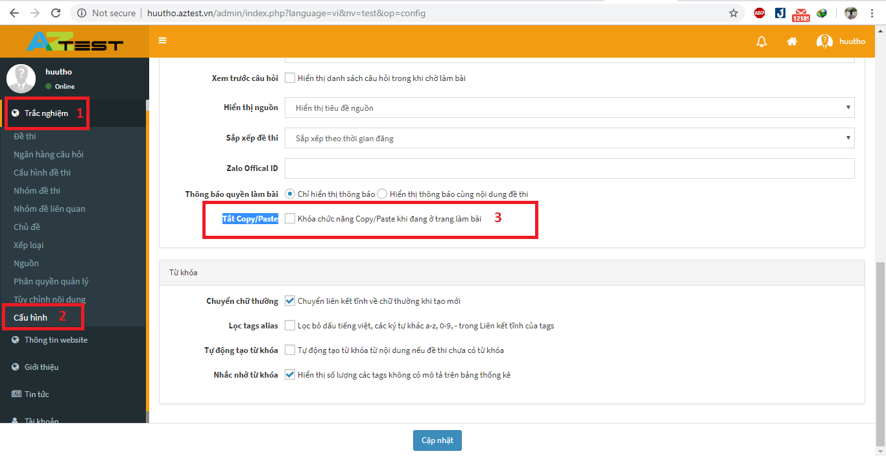

Để phòng chống gian lận trong lúc làm bài thi, AZtest cung cấp thêm tính năng **Tắt Copy/Paste**. Tính năng này ngăn chặn các cá nhân trong lúc làm bài thực hiện việc copy câu hỏi tìm kiếm kết quả, đáp án cho câu hỏi.

Để kích hoạt tính năng này, truy cập **ACP / Trắc nghiệm / Cấu hình** (menu ngang), tìm và tích chọn **Tắt Copy/Paste**. Nhấn **Cập nhật** để lưu lại thiết lập.

 

Mở trang làm bài thi để xem kết quả, lúc này, menu chuột phải đã bị khóa không thể click

