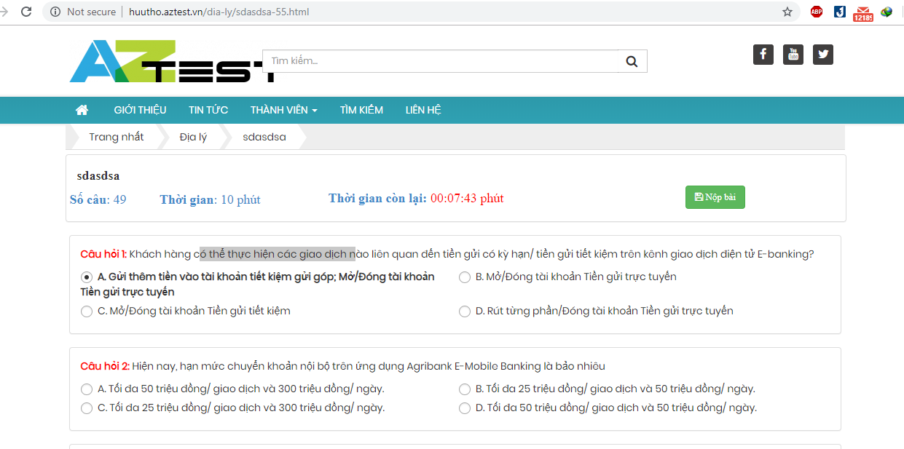

Để phòng chống gian lận trong lúc làm bài thi, AZtest cung cấp thêm tính năng "Tắt Copy/Paste". Tính năng này ngăn chặn các cá nhân trong lúc làm bài thực hiện việc copy câu hỏi tìm kiếm kết quả, đáp án cho câu hỏi.

Để dử dụng chức năng này, người dùng nhấn chọn module **Trắc nghiệm**, chọn menu **Cấu hình**, lúc này trên trang là danh sách các cấu hình mà người dùng quy định cho website. Mặc định cấu hình sẽ bỏ chức năng tắt copy, người dùng cần tick vào checkbox "Tắt Copy/Paste" để ngăn chặn biện pháp copy trong lúc làm bài.

- **(1)**: Truy cập module Trắc nghiệm.
- **(2)**: Chọn menu cấu hình.
- **(3)**: tick vào checkbox "Tắt Copy/Paste" nếu người dùng muốn ngăn chặn biện pháp copy trong lúc làm bài.

 

Khi người dùng đã tắt chức năng copy này thì trên giao diện làm bài, người dùng chỉ có thể bôi đen câu hỏi và không thể thao tác các chức năng copy được

 

