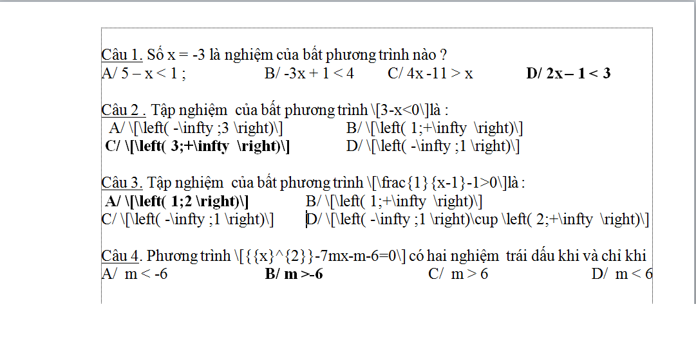

##1. Kiểm tra và thay đổi nội dung đề thi

Đối với mỗi câu hỏi bạn thực hiện lần lượt các thao tác sau:

- Tập tin MS Word chỉ chứa nội dung câu hỏi, câu trả lời. Các nội dung không liên quan ở trên và dưới phần nội dung câu hỏi, câu trả lời cần được xóa bỏ
- Mỗi câu hỏi, đáp án nằm trên một hàng riêng biệt
- Không cần đánh thứ tự số câu. Ví dụ: Câu 1, Câu 2,...... Nếu có, hãy xóa nó đi (Hệ thống sẽ tự đánh khi thể hiện đề thi)
- Không cần đánh thứ tự đán án. Ví dụ: A, B, C, D,..... Nếu có, hãy xóa nó đi (Hệ thống sẽ tự đánh khi thể hiện đề thi)
- Đánh dấu đáp án đúng bằng dấu **sao** (*), đằng trước đáp án đúng. Bạn có thể nhiều dấu sao để chỉ định nhiều đáp án đúng
- Nội dung lời giải đặt bên dưới nội dung câu hỏi, mở đầu bằng một dấu **lớn** (>)
- Mỗi bộ câu hỏi (gồm câu hỏi và đáp án) cách nhau bởi một dòng trắng (Một dấu enter)

Xem ví dụ:

```
Xà phòng hóa hoàn toàn 265,2 gam chất béo (X) bằng dung dịch KOH thu được 288 gam một muối kali duy nhất. Tên gọi của X là
>Đây là nội dung lời giải
*tripanmitoyl glixerol (hay tripanmitin).
trilinoleoyl glixerol (hay trilinolein).
tristearoyl glixerol (hay tristearin).
trioleoyl glixerol (hay triolein).

Nhiều vụ ngộ độc rượu do trong rượu có chứa metanol. Công thức của metanol là
*C2H5OH	
H-CHO	
CH3COOH	
CH3OH

X là sản phẩm sinh ra khi cho fructozơ tác dụng với H2. Đốt cháy hoàn toàn m gam hỗn hợp Y gồm: ancol metylic, glixerol và X thu được 5,6 lít khí CO2 (đktc). Cũng m gam Y trên cho tác dụng với Na dư thu được tối đa V lít khí H2 (đktc). Giá trị của V là
4,48
2,80	
*3,36	
5,60
```

##2. Đối với đề thi có chứa công thức toán học

>Phần này chỉ dành cho nội dung có chứa công thức toán học. Nếu nội dung của bạn không có công thức, hãy chuyển sang bước 3 bên dưới

Để tải đề thi có chứa công thức toán học lên hệ thống, bạn cần phải qua một số thao tác kỹ thuật nhằm chuyển công thức toán sang dạng ký hiệu. Hướng dẫn dưới đây sẽ giúp bạn làm điều này. Nếu đề thi của bạn không chứa công thức toán học, đơn giản hãy bỏ qua phần này và chuyển sang phần 2 bên dưới.

####**Cài đặt phần mềm MathType**
Đây là phần mềm thương mại giúp bạn có thể soạn thảo công thức toán học, sau khi cài đặt nó sẽ được tích hợp trong bộ Office của Microsoft. Ngoài tính năng chính là soạn thảo công thức, phần mềm này có một số công cụ giúp chúng ta chuyển đổi công thức sang nhiều định dạng khác nhau.

Tải về phiên bản mới nhất và tiến hành cài đặt tại [http://www.dessci.com/en/products/mathtype/](http://www.dessci.com/en/products/mathtype/)

####**Sử dụng MathType chuyển đổi công thức toán học sang mã Tex**
- Chọn toàn bộ văn bản (bôi đen)

- Trên thanh định dạng chọn **MathType**, chọn tiếp **Toggle Tex**


Lúc này văn bản chuyển sang dạng như sau:



##3. Thực hiện import câu hỏi cho đề thi

- Sau khi hoàn tất các bước chỉnh sửa đề thi theo cấu hình từ MS Word, bây giờ tiến hành import câu hỏi vào đề thi thuộc hệ thống **AZtest**. 

- Trong khi tạo đề thi mới, bạn hãy chú ý đến phần **Phương thức nhập câu hỏi**, bạn hãy chọn **Nhập câu hỏi từ word**.

 

- Sau khi tạo đề thi thành công, hệ thống sẽ chuyển bạn đến khu vực câu hỏi thuộc đề thi. Tại đây, bạn chọn đến tập tin MS Word đã thao tác ở các bước bên trên, nhấn **Xem trước**
 
 

- Hệ thống sẽ trình bày nội dung từ MS Word lên giao diện web, bạn có thể xem lại nội dung đề thi tại giao diện này. 

> Nếu phát hiện lỗi, hệ thống sẽ thông báo chi tiết lỗi ở bên dưới mỗi câu hỏi, bạn cần sửa hết các lỗi (nếu có) trước khi **Cập nhật** dữ liệu vào đề thi

- Thực hiện nhấn **Cập nhật** để hoàn tất việc import đề thi
