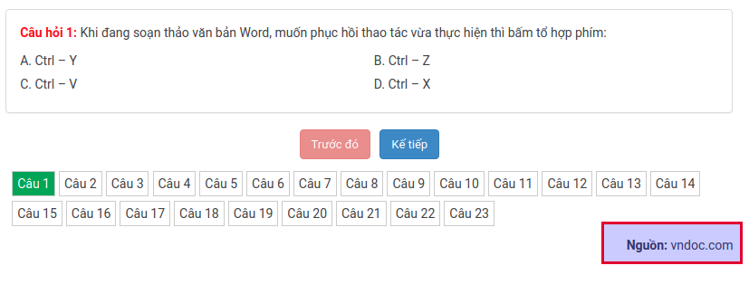

Trong quá trình biên soạn các bộ đề thi trắc nghiệm cho học sinh tự luyện hoặc tổ chức thi chấm điểm, thầy cô có thể tham khảo các nguồn để thi hay từ các đồng nghiệp hoặc các trang đề thi. Để đảm bảo tính bản quyền, AZtest đã cung cấp thêm tính năng thêm thông tin nguồn đề thi.
 
## Thêm thông tin nguồn đề thi

**Bước 1:** Truy cập **ACP / Trắc nghiệm (menu dọc) / Đề thi / Thêm đề thi** (hoặc sửa đề thi)

**Bước 2:** Điền thông tin nguồn đề thi. Giá trị có thể là:

- Một liên kết. Ví dụ: `https://aztest.vn/news/tin-tuc-giao-duc/cach-tao-de-thi-trac-nghiem-mon-lich-su-lop-11-286.html`
- Một văn bản: Ví dụ: **AZtest**

**Bước 3:** Chọn **Cập nhật** để lưu thông tin 

## Quản lý nguồn đề thi

- Với các nguồn đề thi đã khai báo lúc tạo đề, bạn có thể quản lý danh sách các nguồn đề thi này. Bạn có thể đặt lại tiêu đề, liên kết, logo cho nguồn đề thi.
- Truy cập **ACP / Trắc nghiệm (menu dọc) / Nguồn**
- Tại danh sách này, bạn có thể thêm, sửa, xóa các nguồn đề thi đã sử dụng

## Hiển thị thông tin nguồn đề thi

- Với một đề thi có khai báo nguồn, tại giao diện làm bài, bên dưới danh sách câu hỏi, hệ thống hiển thị nguồn của đề thi

- Bạn có thể cấu hình phương án hiển thị nguồn bằng cách truy cập **ACP / Trắc nghiệm (Menu dọc) / Cấu hình**, tìm và thay đổi giá trị ở **Hiển thị nguồn**. Hệ thống cung cấp các kiểu hiển thị như sau:
	- Hiển thị tiêu đề nguồn
	- Hiển thị URL nguồn
	- Hiển thị URL nguồn, kèm thuộc tính `rel="nofollow"`
	- Hiển thị logo của nguồn