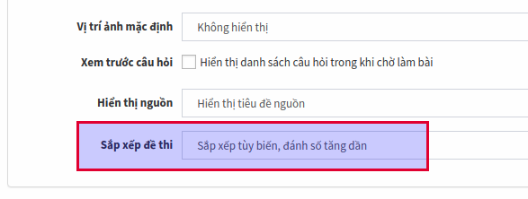
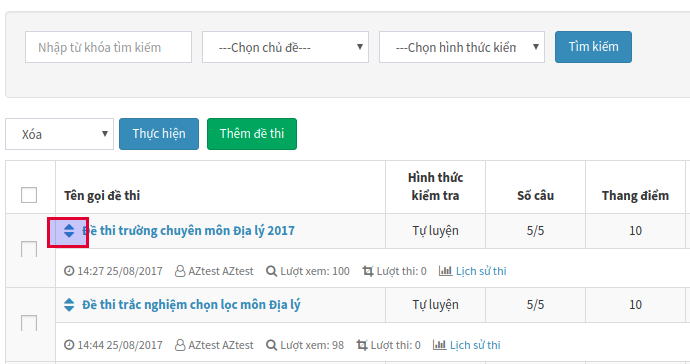
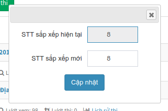

Mặc định, AZtest hiển thị danh sách đề thi theo thời gian tạo đề. Đề mới nhất sẽ hiển thị lên trước. Nếu bạn muốn tùy ý thay đổi vị trí của đề thi, hướng dẫn dưới đây sẽ giúp bạn thực hiện điều đó.

**Bước 1:** Thay đổi cấu hình sắp xếp đề thi

- Truy cập **ACP / Trắc nghiệm (Menu dọc) / Cấu hình**
- Tìm **Sắp xếp đề thi**, thay đổi thành **Sắp xếp tùy biến, đánh số tăng dần**
- Nhấn **Cập nhật** để lưu cấu hình

**Bước 2:** Tùy chỉnh vị trí sắp xếp đề thi

- Truy cập **ACP / Trắc nghiệm (Menu dọc) / Đề thi**. Lúc này, trước tiêu đề đề thi sẽ xuất hiện icon sắp xếp

 
- Tìm đến đề thi muốn thiết lập vị trí, click vào icon sắp xếp, thay đổi giá trị phù hợp tại **STT sắp xếp mới**, nhấn **Cập nhật** để lưu thay đổi

!!! note "Nguyên tắc sắp xếp"
	- Sắp xếp theo thứ tự ưu tiên từ 1, tăng dần
	- Do đó, nếu muốn một để thi được hiển thị đầu tiên, đánh số 1