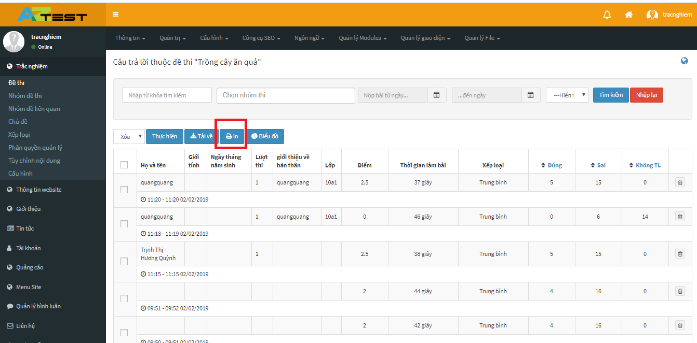
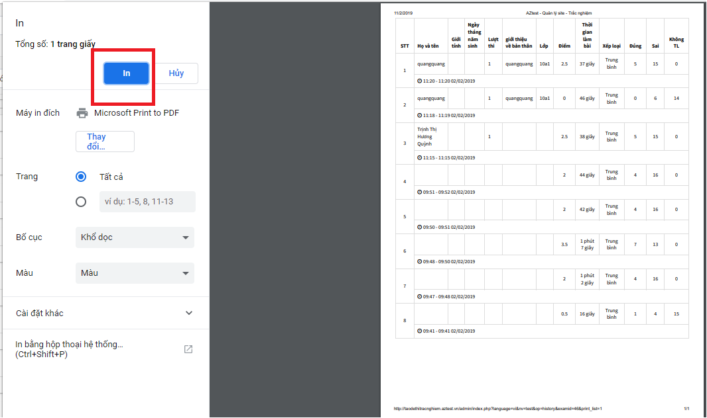
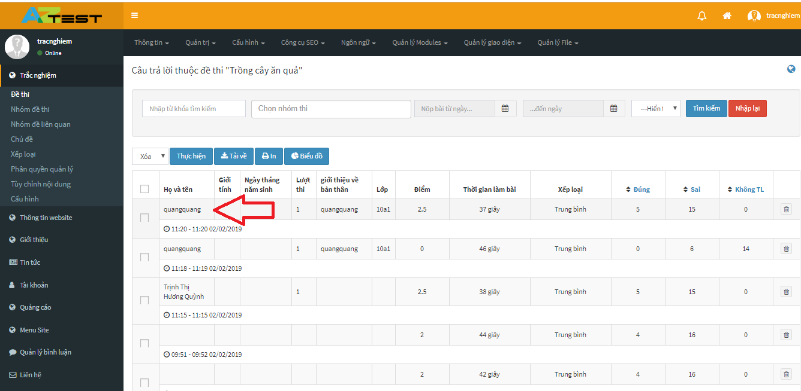
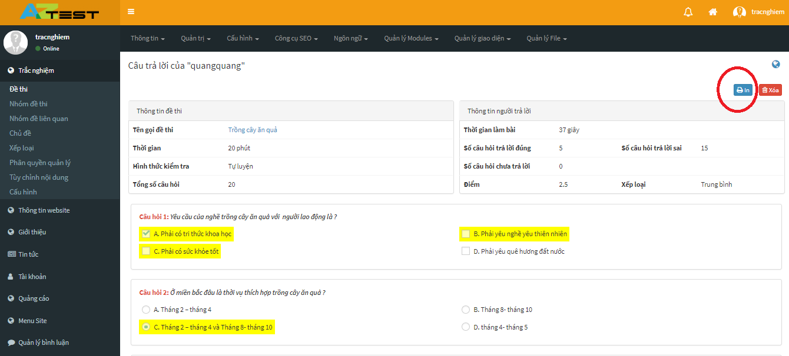

Để xem lại lịch sử thi của thí sinh, bạn thực hiện các bước sau: 

	<iframe width="875" height="398" src="https://www.youtube.com/embed/CRPagW3yKOo" 	frameborder="0" allow="accelerometer; autoplay; encrypted-media; gyroscope; picture-in-picture" allowfullscreen></iframe>

 

Video hướng dẫn xem lại lịch sử thi

Nhấn chọn module **Trắc nghiệm**, chọn menu **Đề thi**, lúc này trên trang là danh sách các đề thi.

 

Trên đề thi, nhấn chọn **Lịch sử thi**.

 

Sau khi nhấn chọn, lịch sử thi của đề thi sẽ hiển thị với các thông tin như sau:

- **Họ và tên (1)**: Họ tên thành viên tham gia thi. Dưới họ tên của mỗi thành viên là thời gian thành viên đó dự thi.
- **Điểm (2)**: Số điểm thành viên đó đạt được.
- **Thời gian làm bài (3)**: Khoảng thời gian thành viên hoàn thành bài thi.
- **Xếp loại (4)**: Xếp loại kết quả bài thi của thành viên.
- **Đúng (5)**: Số câu thành viên trả lời đúng.
- **Sai (6)**: Số câu thành viên trả lời sai.
- **Không TL (7)**: Số câu thành viên không trả lời.

Lịch sử thi này có thể **Xem lại** cho từng thành viên hoặc **Xóa**. (8).

Có các hình thức để tìm kiếm lịch sử thi như: 

- Tìm kiếm theo cách nhập từ khóa tìm kiếm (9).
- Tìm khiếm theo khoảng thời gian dự thi (10).
- Hiển thị số lượng kết quả tìm kiếm (11). 

Sau khi đã nhập đầy đủ các thông tin click **Tìm kiếm** (12) để tìm kiếm lịch sử thi. 

Người dùng có thể in toàn bộ danh sách những thí sinh đã tham gia thi cũng như thông tin liên quan ở bất kỳ đề thi nào.

Thao tác in lịch sử thi hết sức đơn giản: Trong Lịch sử thi của đề thi bạn chọn nút In.

Lúc này sẽ hiển thị ra cửa sổ với đầy đủ các thông tin về lịch sử thi, bạn có thể điều chỉnh hình thức in ở cột bên phải. Sau đó chọn In.

Ngoài ra người dùng có thể in chi tiết kết quả thi của một thí sinh, từ đó có thể đối chiếu giữa kết quả của bài thi với kết quả mà thí sinh đã làm.

Để in kết quả bài thi, chỉ cần click vào tên thí sinh, sau đó sẽ hiển thị ra danh sách bao gồm thông tin đề thi, thông tin người trả lời và kết quả đề thi.

Bạn chỉ cần click nút In ở góc phải màn hình.

