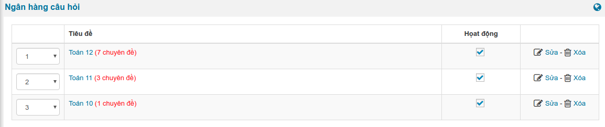

**AZtest** cung cấp hai giải pháp tạo bộ câu hỏi cho đề thi:

- Tạo câu hỏi bằng cách nhập vào danh sách câu hỏi
- Tạo câu hỏi từ ngân hàng câu hỏi

Với **Ngân hàng câu hỏi**, bạn có thể tạo ra các đề thi với bộ câu hỏi được tạo từ ma trận đề thi, từ ngân hàng câu hỏi.

## Tổ chức ngân hàng câu hỏi

Để truy cập **Ngân hàng câu hỏi**, chọn menu **Trắc nghiệm (Menu dọc) => Ngân hàng câu hỏi**, ở biểu mẫu đầu tiên, tiếp hành nhập vào các phân mục. 

**Ví dụ:** Với website của trường THPT, có thể chia thành các chuyên mục như Toán 12, Toán 11, Toán 10



Click vào tên chuyên mục, bạn sẽ khai báo các chuyên đề (Cấp nhỏ hơn của chuyên mục)


Click vào tên chuyên đề, bạn sẽ đến khu vực quản lý danh sách câu hỏi thuộc chuyên đề


Hệ thống chia thành 04 loại câu hỏi:

| **Mã (code)** | **Tên gọi** |
| ---------------------------| --------- |
| NB | Nhận biết |
| TH | Thông hiểu |
| VD | Vận dụng |
| VC | Vận dụng cao |

## Thêm câu hỏi vào ngân hàng

### Nhập câu hỏi

- Tại trang danh sách câu hỏi thuộc chuyên đề, click **Thêm câu hỏi**
- Nhập các thông tin cho câu hỏi

### Nhập câu hỏi từ MS Word

- Tại trang danh sách câu hỏi thuộc chuyên đề, click **Nhập từ MS Word**
- Chuẩn bị file word theo hướng dẫn [Nhập câu hỏi từ MS Word](/huong-dan-mo-rong/nhap-cau-hoi-tu-microsoftword/)
- Để quy định loại câu hỏi, điền các giá trị là mã loại câu hỏi theo cú pháp
```
[Mã] Tiêu đề câu hỏi
```

**Ví dụ**:
```
[NB] Một người gửi tiết kiệm vào một ngân hàng với lãi suất  7,2%/năm. Biết rằng nếu không rút tiền ra khỏi ngân hàng thì cứ sau mỗi năm số tiền lãi sẽ được nhập vào vốn để tính lãi cho năm tiếp theo. Hỏi sau ít nhất bao nhiêu năm người đo thu được (cả số tiền gửi ban đầu và lãi) gấp đôi số tiền gửi ban đầu, giả định trong khoảng thời gian này lãi suất không thay đổi và người đó không rút tiền ra??   
11 năm
12 năm
9 năm
*10 năm
13 năm
>10 năm

[VC] Số phức \[5+6i\] có phần thực bằng
-5
*5
6
-6
```

## Tạo cấu hình (ma trận) đề thi

- Truy cập menu **Trắc nghiệm (menu dọc) => Cấu hình đề thi**
- Click **Thêm cấu hình đề thi**
- Đặt tên cấu hình (tiêu đề), thời gian làm bài,...và các tùy chọn khác
- Thiết lập cấu hình câu hỏi


- Nhấn **Cập nhật** để lưu cấu hình, tương tự cho hành động **Sửa cấu hình**

<p class="title">Tiếp theo</p>

- [Đề thi](/de-thi/)