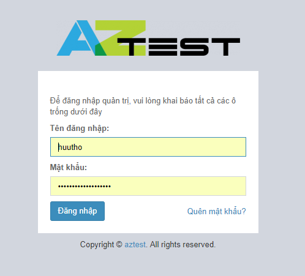
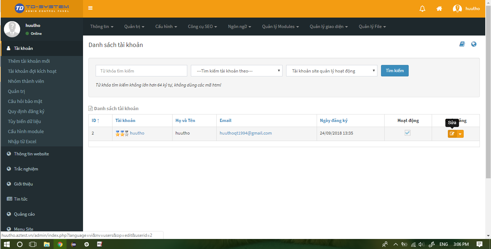

## Khởi tạo website

Bạn có thể khởi tạo website qua các liên kết sau đây:

- Đăng ký gói dùng thử, sau 15 ngày hệ thống tự động chuyển sang gói miễn phí nếu bạn không có động thái chuyển đổi gói dịch vụ. [https://aztest.vn/site/register/](https://aztest.vn/site/register/)
- Lựa chọn gói đăng ký. [https://aztest.vn/bang-so-sanh-tinh-nang.html](https://aztest.vn/bang-so-sanh-tinh-nang.html)

Tiến hành khai báo thông tin vào biểu mẫu, thông tin của bạn cần được bộ phận quản lý nội dung của [AZtest](https://aztest.vn) kiểm duyệt. Thông tin đăng nhập quản trị website sẽ được gửi về email sau khi yêu cầu của bạn được chấp nhận.

## Đăng nhập khu vực quản trị

Sau khi khởi tạo thành công, hệ thống AZtest xét duyệt và gửi email thông báo về cho bạn như hình dưới đây. 

Email này chứa thông tin về website (Tên miền, tiêu đề, tài khoản quản trị,....) và các thông tin cần lưu ý khác. 

Bạn cần lưu ý ghi nhớ **Tên truy cập** và **Mật khẩu** để dùng cho việc xác thực thông tin quản trị bên dưới.

Để đăng nhập vào khu vực quản trị, bạn cần truy cập vào URL đăng nhập khu vực quản trị, URL này có cấu trúc `http://domain/admin/` (với domain là tên miền của bạn). 

Ví dụ: http://huutho.aztest.vn/admin/

> Nội dung email có chứa URL đăng nhập, bạn có thể click vào liên kết đăng nhập quản trị ở nội dung email

Điền thông tin đăng nhập chứa trong email hệ thống AZtest đã gửi về cho bạn để đăng nhập.

	
## Đăng xuất khu vực quản trị

Để đăng xuất khu vực quản trị, chúng ta chọn tài khoản và thoát khỏi tài khoản quản trị.

	

## Thay đổi thông tin tài khoản

- Click vào menu **Tài khoản** (Menu dọc, bên trái màn hình)
- Tại danh sách **Tài khoản** thành viên, click biểu tượng **Sửa** ở cuối tên thành viên bạn muốn sửa đổi thông tin
- Tiến hành điều chỉnh thông tin, sau đó nhấn nút **Lưu** ở cuối trang để kết thúc

 
## Chuyển đổi gói dịch vụ

Khi muốn chuyển đổi gói dịch vụ, vui lòng liên hệ với AZtest tại [đây](https://aztest.vn/contact/) để được hỗ trợ. Sau khi nhận yêu cầu, bộ phận chăm sóc khách hàng của AZtest sẽ liên hệ để thực hiện một số thủ tục, website của bạn sẽ được tự động chuyển đổi gói dịch vụ sau khi giao dịch thành công.

## Các câu hỏi thường gặp
**Tôi có thể yêu cầu thêm các tính năng ở website của tôi không?**

AZtest sẵn sàng mở rộng tính năng áp dụng cho từng website cụ thể trong cùng hệ thống. Để làm phong phú hơn website của bạn, bạn có thể yêu cầu AZtest lập trình thêm tính năng. Nếu là tính năng mang tính cá nhân, bạn sẽ phải trả một khoản phí cho việc xây dựng tính năng đó, ngược lại nếu tính năng mang tính cộng đồng (ai cũng có nhu cầu) thì AZtest sẽ bổ sung cho hệ thống của chúng ta hay hơn mà bạn không mất một khoản phí nào.

Bạn có thể liên hệ với AZtest hoặc đưa ý tưởng lên các kênh thảo luận.

**Tôi có thể dụng tên miền riêng cho website của tôi không?**

Nếu đã có tên miền, vui lòng trỏ tên miền về IP `61.14.235.164`, sau đó liên hệ với chúng tôi để được hỗ trợ chuyển đổi tên miền.
Trường hợp bạn chưa có tên miền, muốn mua tên miền mới, chúng tôi sẵn sàng cung cấp và hỗ trợ cấu hình tên miền mới cho website của bạn. Liên hệ để được tư vấn về giá.

**Tôi thấy website khá hay, rất hiệu quả cho vấn đề giáo dục hiện nay và tôi muốn dùng ở các kỳ thi tập trung không?** 

Vê vấn đề này hệ thống AZtestPro của chúng tôi có thể đáp ứng được nhu cầu của bạn, để dùng hệ thống AZtestPro bạn vui lòng tham khảo và đăng ký tại [đây](https://aztest.vn/aztestpro-he-thong-thi-trac-nghiem-tap-trung.html)

Vui lòng liên hệ với chúng tôi để được tư vấn chi tiết:

- CÔNG TY TNHH PHÁT TRIỂN VÀ DỊCH VỤ NGUỒN MỞ THUẬN ĐỨC.
- Điện thoại: +84-2336270610
- Hotline: +84-905908430 (hỗ trợ 24/7)
- Email: contact@tdfoss.vn