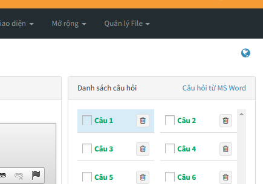

## Các thiết lập ban đầu

> Đây là quá trình xây dựng các dữ liệu ban đầu, phục vụ cho các tính năng khác của hệ thống. Do đó, bạn không được bỏ qua các thiết lập theo các hướng dẫn trong phần này.

### Xóa dữ liệu mẫu

Dữ liệu mẫu là dữ liệu được AZtest nhập sẵn sau khi khởi tạo website, nhằm mục đích giúp người quản trị có cái nhìn tổng quan về website của mình. Bạn cần xóa các dữ liệu này trước khi bắt đầu xây dựng nội dung website.

Để xóa dữ liệu mẫu, thực hiện theo các bước sau đây:

> Hành động này sẽ xóa hết tất cả dữ liệu của module **Trắc nghiệm**, bạn không thể khôi phục lại dữ liệu sau khi đã xóa. Việc này chỉ phù hợp với website mới, cần xóa dữ liệu demo.

- [Đăng nhập khu vực quản trị website](/start/#ang-nhap-khu-vuc-quan-tri)
- Truy cập **Quản lý modules** (menu ngang)
- Trong bảng danh sách module, tìm đến dòng có tên module là **test** (hình) 

  

- Click nút **Cài lại** ở cuối dòng này. Hệ thống sẽ hiển thị hộp thoại nhỏ để xác nhận thêm một lần nữa, click **Thực hiện** để đồng ý xóa.

### Thiết lập chủ đề

**Chủ đề** là đơn vị giúp phân loại đề thi trong hệ thống AZtest. Qua chủ đề, chúng ta có thể thiết lập các thuộc tính (cấu hình) riêng cho các đề thi nằm cùng một chủ đề. 

Bạn cần tạo ít nhất 01 chủ đề trước khi thực hiện các bước tiếp theo.

Xem [Quản lý chủ đề](/test/#quan-ly-chu-e)

### Thiết lập xếp loại

Xếp loại là hình thức đánh giá kết quả thi dựa vào điểm thi. Xếp loại có thể dễ dàng cấu hình theo ý của người quản trị.

Xem [Quản lý xếp loại](/test/#quan-ly-xep-loai)

## Quản lý chủ đề

Truy cập **Trắc nghiệm / Chủ đề** (menu dọc)


Trên danh sách chủ đề, bạn có thể:

- Click vào Tiêu đề để truy cập đến danh sách chủ đề con
- **Hiển thị trang chủ:** Cấu hình cho phép Hiển thị / Không hiển thị chủ đề (và các đề thi thuộc chủ đề) lên trang chủ của website.
- **Số liên kết:** Quy định số đề thi cùng chủ đề được gợi ý khi xem một đề thi bất kỳ
- **Phương án hiển thị:** Quy định giao diện hiển thị đề thi khi xem chủ đề
- **Thống kê điểm cao:** Quy định giao diện hiển thị đề thi khi xem chủ đề

### Thêm chủ đề

Tại khu vực thêm chủ đề, nhập đầy đủ thông tin bắt buộc (trường có dấu sao):

- **Tiêu đề (1):** Nhập tên cho chủ đề. Ví dụ: Đề thi toán, đề thi lý, đề thi hóa,...
- **Liên kết tĩnh (2):** Phần này sẽ tự động tạo sau khi nhập xong Tiêu đề, bạn có thể sửa lại hoặc không (không được để trống)
- **Thuộc chủ đề (3):** Chọn chủ đề trực thuộc (Bạn có thể thêm chủ đề con của một chủ đề bằng cách chọn chủ đề trực thuộc)
- **Title tag (4):**  (SEO) Nhập thẻ tiêu đề, 
- **Mô tả (5):** Mô tả ngắn gọn về chủ đề.
- **Hình ảnh (6):** Chọn hình ảnh minh họa cho chủ đề. 
- **Từ khóa (8):** Nhập từ khóa tìm kiếm cho chủ đề.


Sau khi nhập thông tin, nhấn nút **Cập nhật** để tiến hành thêm. Nếu thêm thành công, chủ đề mới sẽ xuất hiện trong danh sách chủ đề.

### Sửa chủ đề

- Tại danh sách các chủ đề, click nút **Sửa** ở cuối dòng
- Hành động sửa cũng như hành động [Thêm chủ đề](/test/#them-chu-e)

### Xóa chủ đề

- Tại danh sách các chủ đề, click nút **Xóa** ở cuối dòng
- Xóa chủ đề cha, cũng đồng thời xóa chủ đề con của nó
- Xóa chủ đề sẽ xóa hết các dữ liệu thuộc chủ đề đó (Đề thi, lịch sử thi,...). Bạn cần chuyển dữ liệu cần thiết sang chủ đề khác trước khi quyết định xóa một chủ đề

## Quản lý xếp loại

- Truy cập **Trắc nghiệm / Quản lý xếp loại** (menu dọc)
- Mặc định, AZtest cấu hình sẵn 05 mốc xếp loại phổ biến, bạn có thể thay đổi các giá trị phù hợp với yêu cầu.


## Quản lý đề thi

> Để bắt đầu tạo một đề thi mới, bạn hãy chắc chắn đã đọc và thực hiện xong các yêu cầu tại [Các thiết lập ban đầu](/test/#cac-thiet-lap-ban-au)

Truy cập **Trắc nghiệm (1) / Đề thi (2)** (menu dọc)


### Tạo đề thi mới

Trên giao diện **Quản lý đề thi**, click **Thêm đề thi (3)**


> Cần nhập đầy đủ các trường có gắn dấu sao (*) ở cuối trước khi nhấn **Cập nhật**

Giải thích các trường thông tin:

- **Tên gọi đề thi (1):**  Nhập tên đề thi. Ví dụ: Đề thi toán học kỳ 2, năm học 2017-2018
- **Liên kết tĩnh (2):** Đây là chuỗi quy định URL của một đề thi. Chuỗi này thường được tự động tạo sau khi điền xong Tiêu đề. Do đó, bạn có thể không cần quan tâm đến nó, cứ để giá trị có sẵn. Ví dụ: tương ứng với tiêu đề bên trên thì chúng ta sẽ có liên kết tĩnh tương ứng là `de-thi-toan-hoc-ky-2-nam-hoc-2017-2018`.
- **Chủ đề (3):** Chọn Chủ đề cho đề thi, danh sách đề thi quản lý tại [Quản lý đề thi](/test/#quan-ly-e-thi)
- **Hình ảnh (5):** Chọn ảnh đại diện cho đề thi, ảnh này sẽ hiển thị bên cạnh đề thi
- **Giới thiệu (6):** Mô tả ngắn gọn về nội dung đề thi
- **Nội dung (7):** Nhập nội dung mô tả chi tiết cho đề thi
- **Nhóm tham gia thi (8):** Chọn nhóm thành viên được phép thực hiện đề thi này. Xem thêm [Quản lý nhóm thành viên](/system/#quan-ly-nhom-thanh-vien)
- **Nhóm được bình luận (9):** Nhóm thành viên được phép bình luận trong trang xem chi tiết đề thi.
- **Nhóm xem đáp án sau bài làm (10):** Nhóm thành viên được phép xem đáp án sau khi làm bài.


- **Hình thức kiểm tra (1):**
	- **Tự luyện:** Cho phép một thành viên thi nhiều lượt, mỗi lượt thi hệ thống sẽ tự động thay đổi vị trí các câu hỏi và đáp án. Mỗi lượt thi đều chấm điểm.
	- **Chấm điểm:** Đề thi chỉ cho phép mỗi thành viên thi một lượt và được chấm điểm. Phương án này phù hợp với việc tổ chức các kỳ thi để lấy kết quả thi.
- **Số lượng câu hỏi (2):** Nhập số lượng câu hỏi cho đề thi
- **Thang điểm (3):** Nhập thang điểm cho đề thi. Ví dụ: thang điểm 10 thì nhập là 10
- **Thời gian làm bài (4):** Nhập thời gian làm bài cho đề thi, **thời gian tính bằng đơn vị phút**.
- **Số câu hỏi trên trang (5):** Nhập số câu hỏi hiển thị trên một trang. Trường hợp đề có nhiều câu hỏi thì việc phân trang sẽ giúp tiết kiệm 
- **Phương thức nhập câu hỏi (6):**
	- **Nhập câu hỏi mới:** Sau khi thêm đề thi thành công, hệ thống sẽ chuyển bạn đến giao diện nhập nội dung câu hỏi
	- **Nhập từ Microsoft Word:** Sau khi thêm đề thi thành công, hệ thống sẽ chuyển bạn đến giao diện nhập nội dung từ file Word
- **Tích chọn các tính năng mở rộng cho đề thi (7):** 
	- **Hiển thị ngẫu nhiên câu hỏi và đáp án:** Sau mỗi lượt thi, các câu hỏi sẽ được hiển thị ngẫu nhiên, các đáp án sẽ ngẫu nhiên thay đổi vị trí.
	- **Hiển thị xếp loại sau làm bài:** Sau khi nộp bài, hệ thống căn cứ vào kết quả và xếp loại bài thi của bạn. Bạn cần cấu hình xếp loại để hiển thị đúng tiêu chí này.
	- **Lưu lịch sử làm bài:** Hệ thống tự động lưu lại lịch sử thi của thành viên
	- **Cho phép làm lại bài:** Cho phép thành viên có thể làm lại bài thi
	- **Cho phép in đề:** Hệ thống sẽ in đề thi trực tiếp

Sau khi điền đầy đủ các trường thông tin cần thiết, nhấn **Cập nhật** để thêm đề thi. Dựa vào lựa chọn **Phương thức nhập câu hỏi (6)**, hệ thống sẽ chuyển bạn đến trang tương ứng để tiếp tục nhập câu hỏi cho đề thi.

## Quản lý câu hỏi của đề thi

## Nhập câu hỏi từ Microsoft Word

> Tính năng này không có trong gói miễn phí. Vui lòng nâng cấp lên gói cao hơn.

### Đối với đề thi có chứa công thức toán học

> Phần này chỉ dành cho danh sách câu hỏi chứa công thức toán học. Nếu nội dung bạn không tồn tại công thức, hãy bỏ qua phần này

Để tải đề thi có chứa công thức toán học lên hệ thống, bạn cần phải qua một số thao tác kỹ thuật nhằm chuyển công thức toán sang dạng ký hiệu. Hướng dẫn dưới đây sẽ giúp bạn làm điều này.

**Cài đặt phần mềm MathType**

Đây là phần mềm thương mại giúp bạn có thể soạn thảo công thức toán học, sau khi cài đặt nó sẽ được tích hợp trong bộ Office của Microsoft. Ngoài tính năng chính là soạn thảo công thức, phần mềm này có một số công cụ giúp chúng ta chuyển đổi công thức sang nhiều định dạng khác nhau.

Tải về phiên bản mới nhất và tiến hành cài đặt tại [http://www.dessci.com/en/products/mathtype/](http://www.dessci.com/en/products/mathtype/)

**Sử dụng MathType chuyển đổi công thức toán học sang mã Tex**

- Chọn toàn bộ văn bản (bôi đen)
- Trên thanh định dạng chọn **MathType**, chọn tiếp **Toggle Tex**


Lúc này văn bản chuyển sang dạng như sau


Bạn cần lưu nội dung mới này là để thực hiện bước tiếp theo.

### Chỉnh sửa đề thi theo chuẩn của hệ thống yêu cầu

**Kiểm tra và thay đổi nội dung đề thi**

>Hệ thống sẽ tự động xóa hết tất cả các định dạng trong nội dung đề thi (in đậm, in nghiêng, hình ảnh, màu sắc,....). Do đó, bạn cần định dạng lại nội dung sau khi thêm câu hỏi thành công.

Đối với mỗi câu hỏi bạn thực hiện lần lượt các thao tác sau:

- Mỗi câu hỏi, đáp án nằm trên một hàng riêng biệt
- Không cần đánh thứ tự số câu. Ví dụ: Câu 1, Câu 2,...... Nếu có, hãy xóa nó đi (Hệ thống sẽ tự đánh khi thể hiện đề thi)
- Không cần đánh thứ tự đán án. Ví dụ: A, B, C, D,..... Nếu có, hãy xóa nó đi (Hệ thống sẽ tự đánh khi thể hiện đề thi)
- Đánh dấu đáp án đúng bằng ký tự sao (*), đằng trước đáp án đúng
- Mỗi bộ câu hỏi (gồm câu hỏi và đáp án) cách nhau bởi một dòng trắng (Enter)

Xem ví dụ:

```

Xà phòng hóa hoàn toàn 265,2 gam chất béo (X) bằng dung dịch KOH thu được 288 gam một muối kali duy nhất. Tên gọi của X là
*tripanmitoyl glixerol (hay tripanmitin).
trilinoleoyl glixerol (hay trilinolein).
tristearoyl glixerol (hay tristearin).
trioleoyl glixerol (hay triolein).

Nhiều vụ ngộ độc rượu do trong rượu có chứa metanol. Công thức của metanol là
*C2H5OH	
H-CHO	
CH3COOH	
CH3OH

X là sản phẩm sinh ra khi cho fructozơ tác dụng với H2. Đốt cháy hoàn toàn m gam hỗn hợp Y gồm: ancol metylic, glixerol và X thu được 5,6 lít khí CO2 (đktc). Cũng m gam Y trên cho tác dụng với Na dư thu được tối đa V lít khí H2 (đktc). Giá trị của V là
4,48
2,80	
*3,36	
5,60
```

Bạn cần lưu nội dung mới này là để thực hiện bước tiếp theo.

**Sử dụng macro tự động chuyển sang cấu trúc chuẩn AZtest**

Cài đặt macro AZtest

Việc cài đặt marco này chỉ thực hiện một lần trên một máy tính, lần sau bạn không cần phải thực hiện bước này nữa.

**Bước 1:** Trên giao diện Microsoft Word (2007 -> 2013), chọn tab **View => Macros => View macros**


**Bước 2:** Trên cửa sổ nhỏ mới xuất hiện, chọn Create để tạo mới marco.


**Bước 3:** Trên cửa sổ lớn mới xuất hiện, xóa hết nội dung có sẵn, sau đó copy nội nội mới này vào

```
Sub AZTEST_WORD()
    Dim MyText As String
    Dim MyRange As Object
    iParcount = ActiveDocument.Paragraphs.Count
    Dim I, J, Question As Long
    J = 1
    I = 1
    Question = 1
    Do
        ' Lay du lieu cua doan van
       Set MyRange = ActiveDocument.Paragraphs(J).Range
       ' Doan van dau tien la de bai, them tieu de cau hoi va dau ngoac nhon
       If I = 1 Then
          MyText = "::Question" & Question & "::"
          MyRange.InsertBefore (MyText)
          MyText = "[BEGIN]" & Chr(13)
          MyRange.InsertAfter (MyText)
          J = J + 1
          iParcount = iParcount + 1   ' Do them 1 dong moi
          Set MyRange = ActiveDocument.Paragraphs(J).Range
       End If
       ' Doan van thu 2 den 5 la cac dap an, them dau nga
       If I = 2 Or I = 3 Or I = 4 Or I = 5 Then
          MyText = "~"
          MyRange.InsertBefore (MyText)
       End If
       ' Doan van cuoi cung them dau ngoac ket thuc cau hoi
       If I = 5 Then
          MyText = "[END]" & Chr(13)
          MyRange.InsertAfter (MyText)
          J = J + 1
          iParcount = iParcount + 1   ' Do them 1 dong moi
          Set MyRange = ActiveDocument.Paragraphs(J).Range
       End If
       ' Cap nhat lai gia tri i the hien cau nao trong cau hoi trac nghiem
       I = I + 1
       If I = 7 Then
            I = 1
            Question = Question + 1
       End If
       J = J + 1
    Loop Until J > iParcount
        ' Thay the ~* thanh dau =: dap an
    With ActiveDocument.Content.Find
    .ClearFormatting
    With .Replacement
        .ClearFormatting
        .Font.Bold = False
    End With
    .Execute FindText:="~*", ReplaceWith:="=", Replace:=wdReplaceAll
    End With
End Sub
```


Nhấn **Ctrl + S** để lưu lại, bây giờ có thể đóng cửa sổ này.

**Tự động chuyển về cấu trúc hợp lệ**

- Thực hiện lại bước trên, song lúc này chúng ta sẽ thấy marco **AZTEST_WORD** đã được cài đặt. Nhấn chọn **AZTEST_WORD (1)** và nhấn **RUN (2)**
- Nội dung file word lúc này sẽ được tự động định dạng lại để phù hợp với yêu cầu của hệ thống AZtest, copy lại nội dung này để thực hiện bước tiếp theo.


### Thực hiện import câu hỏi cho đề thi

- Sau khi hoàn tất các bước chỉnh sửa đề thi theo cấu hình từ MS Word, bây giờ tiến hành import câu hỏi vào đề thi thuộc hệ thống AZtest. 
- Từ giao diện quản lý câu hỏi, click **Nhập câu hỏi từ MS Word**



- Thực hiện dán nội dung bạn đã chuyển đổi bên trên vào


- Nhấn **Cập nhật** để hoàn tất. Nếu thành công, bạn sẽ thấy được danh sách câu hỏi mới.