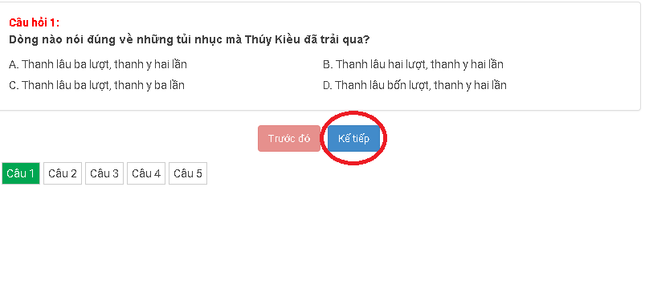
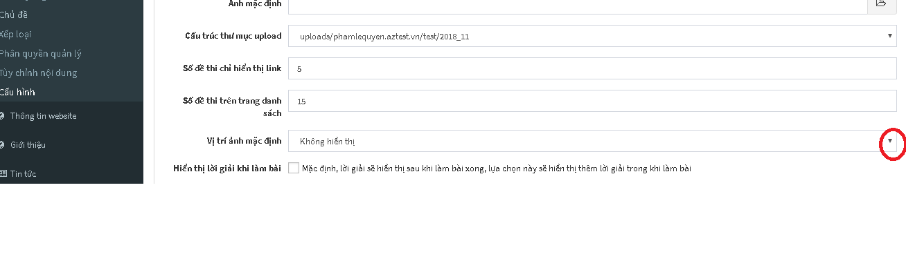

## Các thiết lập ban đầu

> Đây là quá trình xây dựng các dữ liệu ban đầu, phục vụ cho các tính năng khác của hệ thống. Do đó, bạn không được bỏ qua các thiết lập theo các hướng dẫn trong phần này.

### Xóa dữ liệu mẫu

Dữ liệu mẫu là dữ liệu được AZtest nhập sẵn sau khi khởi tạo website, nhằm mục đích giúp người quản trị có cái nhìn tổng quan về website của mình. Bạn cần xóa các dữ liệu này trước khi bắt đầu xây dựng nội dung website.

Để xóa dữ liệu mẫu, thực hiện theo các bước sau đây:

> Hành động này sẽ xóa hết tất cả dữ liệu của module **Trắc nghiệm**, bạn không thể khôi phục lại dữ liệu sau khi đã xóa. Việc này chỉ phù hợp với website mới, cần xóa dữ liệu demo.

- [Đăng nhập khu vực quản trị website](/start/#ang-nhap-khu-vuc-quan-tri)
- Truy cập **Quản lý modules** (menu ngang)
- Trong bảng danh sách module, tìm đến dòng có tên module là **test** (hình) 

  

- Click nút **Cài lại** ở cuối dòng này. Hệ thống sẽ hiển thị hộp thoại nhỏ để xác nhận thêm một lần nữa, click **Thực hiện** để đồng ý xóa.

### Thiết lập chủ đề

**Chủ đề** là đơn vị giúp phân loại đề thi trong hệ thống AZtest. Qua chủ đề, chúng ta có thể thiết lập các thuộc tính (cấu hình) riêng cho các đề thi nằm cùng một chủ đề. 

Bạn cần tạo ít nhất 01 chủ đề trước khi thực hiện các bước tiếp theo.

Xem [Quản lý chủ đề](/test/#quan-ly-chu-e)

### Thiết lập xếp loại

Xếp loại là hình thức đánh giá kết quả thi dựa vào điểm thi. Xếp loại có thể dễ dàng cấu hình theo ý của người quản trị.

Xem [Quản lý xếp loại](/test/#quan-ly-xep-loai)

## Quản lý chủ đề

Truy cập **Trắc nghiệm / Chủ đề** (menu dọc)


Trên danh sách chủ đề, bạn có thể:

| Trường thông tin | Mô tả |
| ---------------- | ----- |
|**Tiêu đề** | Truy cập đến danh sách chủ đề con | 
|**Hiển thị trang chủ** | Cấu hình cho phép Hiển thị / Không hiển thị chủ đề (và các đề thi thuộc chủ đề) lên trang chủ của website |
|**Số liên kết** | Quy định số đề thi cùng chủ đề được gợi ý khi xem một đề thi bất kỳ |
|**Phương án hiển thị** | Quy định giao diện hiển thị đề thi khi xem chủ đề |
|**Thống kê điểm cao** | Quy định giao diện hiển thị đề thi khi xem chủ đề | 

### Thêm chủ đề

Tại khu vực thêm chủ đề, nhập đầy đủ thông tin bắt buộc (trường có dấu sao):

| Trường thông tin | Mô tả | 
| ---------------- | ----- | 
|**Tiêu đề (1)** | Nhập tên cho chủ đề. Ví dụ: Đề thi toán, đề thi lý, đề thi hóa,... |
|**Liên kết tĩnh (2)** | Phần này sẽ tự động tạo sau khi nhập xong Tiêu đề, bạn có thể sửa lại hoặc không (không được để trống) |
|**Thuộc chủ đề (3)** | Chọn chủ đề trực thuộc (Bạn có thể thêm chủ đề con của một chủ đề bằng cách chọn chủ đề trực thuộc) |
|**Title tag (4)** | (SEO) Nhập thẻ tiêu đề |
|**Mô tả (5)** | Mô tả ngắn gọn về chủ đề |
|**Hình ảnh (6)** | Chọn hình ảnh minh họa cho chủ đề |
|**Từ khóa (8)** | Nhập từ khóa tìm kiếm cho chủ đề |


Sau khi nhập thông tin, nhấn nút **Cập nhật** để tiến hành thêm. Nếu thêm thành công, chủ đề mới sẽ xuất hiện trong danh sách chủ đề.

### Sửa chủ đề

- Tại danh sách các chủ đề, click nút **Sửa** ở cuối dòng
- Hành động sửa cũng như hành động [Thêm chủ đề](/test/#them-chu-e)

### Xóa chủ đề

- Tại danh sách các chủ đề, click nút **Xóa** ở cuối dòng
- Xóa chủ đề cha, cũng đồng thời xóa chủ đề con của nó
- Xóa chủ đề sẽ xóa hết các dữ liệu thuộc chủ đề đó (Đề thi, lịch sử thi,...). Bạn cần chuyển dữ liệu cần thiết sang chủ đề khác trước khi quyết định xóa một chủ đề

## Quản lý xếp loại

- Truy cập **Trắc nghiệm / Quản lý xếp loại** (menu dọc)
- Mặc định, AZtest cấu hình sẵn 05 mốc xếp loại phổ biến, bạn có thể thay đổi các giá trị phù hợp với yêu cầu.


## Quản lý đề thi

> Để bắt đầu tạo một đề thi mới, bạn hãy chắc chắn đã đọc và thực hiện xong các yêu cầu tại [Các thiết lập ban đầu](/test/#cac-thiet-lap-ban-au)

Truy cập **Trắc nghiệm (1) / Đề thi (2)** (menu dọc)


### Tạo đề thi mới

Bạn cần đăng nhập vào khu vực quản trị trước khi sử dụng tính năng này. Thông tin tài khoản đã được gửi qua email khi bạn đăng ký dịch vụ.

Trên giao diện quản trị, truy cập **Trắc nghiệm** >>> Chọn Menu **Đề thi** (1) >>> Chọn **Thêm đề thi** (2)


> Cần nhập đầy đủ các trường có gắn dấu sao (*) ở cuối trước khi nhấn **Cập nhật**


Giải thích các trường thông tin:

| Trường thông tin | Mô tả |
|------------------|-------|
|**Tên gọi đề thi (1)**| Nhập tiêu đề cho đề thi |
|**Liên kết tĩnh (2)**| Cấu hình liên kết URL cho đề thi, phần này sẽ tự động tạo sau khi nhập xong Tên gọi đề thi, bạn có thể sửa lại hoặc không |
|**Chủ đề (3)**| Chọn chủ đề cho đề thi. (Cần có ít nhất chủ đề trước khi thêm đề thi) |
|**Dòng sự kiện (4)**| Chọn thêm đề thi vào nhóm đề thi liên quan. Khi bạn click, các nhóm đề thi liên quan trước đó sẽ xuất hiện, bạn chọn nhóm đề thi liên quan muốn liên kết. |
|**Hình ảnh (5)**| Chọn ảnh đại diện cho đề thi (hiển thị trên danh sách) |
|**Giới thiệu (6)**| Mô tả ngắn gọn về nội dung đề thi |
|**Nội dung (7)**| Nhập nội dung mô tả chi tiết cho đề thi |
|**Nhóm tham gia thi (8)**| Chọn nhóm thành viên được phép thực hiện đề thi này |
|**Nhóm được bình luận (9)**| Nhóm thành viên được phép bình luận trong trang xem chi tiết đề thi | 
|**Nhóm xem đáp án sau bài làm (10)**| Nhóm thành viên được phép xem đáp án sau khi làm bài. |

Nhập tương tự cho các thông tin tiếp theo


| Trường thông tin | Mô tả | 
| -----------------| ------| 
| **Chọn hình thức kiểm tra (1)**| <ul><li>Tự luyện: Đề thi cho phép một thành viên thi nhiều lượt, mỗi lượt thi hệ thống sẽ tự động thay đổi vị trí các câu hỏi và đáp án.Mỗi lượt thi đều chấm điểm <li>Chấm điểm: Đề thi chỉ cho phép mỗi thành viên thi một lượt và được chấm điểm. Phương án này phù hợp với việc tổ chức các kỳ thi để lấy kết quả thi.|
|**Số lượng câu hỏi (2)** | Nhập số lượng câu hỏi của đề thi |
|**Thang điểm (3)** | Nhập thang điểm của đề thi |
|**Thời gian làm bài (4)** | Nhập thời gian làm bài của đề thi, thời gian tính bằng đơn vị phút. |
|**Số câu hỏi trên trang (5)** | Nhập số câu hỏi hiển thị trên một trang, nếu không muốn phân trang thì nhập 0, hệ thống sẽ tự động phân trang |
|**Phương thức nhập câu hỏi (6)** | <ul><li>Nhập câu hỏi mới: Sau khi thêm đề thi thành công, hệ thống sẽ chuyển bạn đến giao diện nhập nội dung câu hỏi<li>Nhập từ Microsoft Word: Sau khi thêm đề thi thành công, hệ thống sẽ chuyển bạn đến giao diện nhập nội dung từ file Word </ul>|
|**Tích chọn các tính năng mở rộng cho đề thi (7)** | <ul><li>Hiển thị ngẫu nhiên câu hỏi và đáp án: Sau mỗi lượt thi, các câu hỏi sẽ được hiển thị ngẫu nhiên, các đáp án sẽ ngẫu nhiên thay đổi vị trí.<li>Hiển thị xếp loại sau làm bài: Sau khi nộp bài, hệ thống căn cứ vào kết quả và xếp loại bài thi của bạn. Bạn cần cấu hình xếp loại để hiển thị đúng tiêu chí này.<li>Lưu lịch sử làm bài: Hệ thống tự động lưu lại lịch sử thi của thành viên<li>Cho phép làm lại bài: Cho phép thành viên có thể làm lại bài thi<li>Cho phép in đề: Hệ thống sẽ in đề thi trực tiếp.|
|**Cập nhật (8)** | Nhấn chọn Cập nhật (8) để hoàn tất. |

###Thêm câu hỏi
Sau khi cập nhật, giao diện trang xuất hiện câu hỏi:


| Trường thông tin | Mô tả |
| -----------------| ------| 
|**Loại câu hỏi (1)** | Nhấn chọn loại câu hỏi <ul><li>Câu hỏi trắc nghiệm: Loại câu hỏi với các đáp án cho sẵn, học sinh chọn ra các đáp án đúng, mỗi câu hỏi có thể có một hoặc nhiều đáp án đúng .<li>Câu hỏi điền vào ô trống: Loại câu hỏi yêu cầu điền vào ô trống câu trả lời đúng tương ứng với dữ liệu đã cho trong câu hỏi.<li>Câu hỏi chung: Loại câu hỏi gồm câu hỏi và đoạn văn bản đọc hiểu. Học sinh dựa vào đoạn văn bản đề chọn câu trả lời cho câu hỏi.|
|**Tiêu đề (2)** | Nhập tiêu đề chính là nội dung câu hỏi. |
|**Danh sách câu hỏi (3)** | Danh sách các câu hỏi của đề thi |
|**Câu hỏi màu xanh (4)** | Câu hỏi đã nhập nội dung sẽ có màu xanh (4) |
|**Câu hỏi màu đỏ (5)** | Câu chưa nhập nội dung có màu đỏ. Các câu hỏi này có thể xóa (5) |

###Đáp án 


| Trường thông tin | Mô tả |
| -----------------| ------|
|**Trình bày đáp án (1)** | <ul><li>Chia đều hai cột: Các đáp án sẽ được chia đều thành 2 cột.<li>Các đáp án trên một hàng: Tất cả các đáp án của câu hỏi sẽ được trình bày trên một hàng.<li>Mỗi đáp án một hàng: Mỗi đáp án của câu hỏi nằm tách biệt trên một hàng. |
|**Sử dụng editor cho nội dung đáp án (2)** | Trong trường hợp đáp án câu hỏi có sử dụng hình ảnh, định dạng văn bản,...thì bạn tích chọn Sử dụng editor cho nội dung đáp án (2), khung soạn thảo sẽ được chuyển sang dạng trình soạn thảo văn vản. |
|**Thêm đáp án (3)** | Sau khi nhập nội dung đáp án A, bạn nhấn chọn thêm đáp án để thêm đáp án B, C.... Hệ thống không giới hạn số lượng các đáp án được tạo. |
|**Chọn đáp án đúng (4)** | Bạn cần chọn ít nhất một đáp án đúng (4) cho câu hỏi, một câu hỏi có thể có nhiều đáp án đúng. |
|**Cập nhật (5)** | Nhấn nút Cập nhật (5) để lưu câu hỏi. Bạn sẽ được tự động chuyển sang câu hỏi tiếp theo để tiếp tục soạn thảo. |

Quá trình này lặp đi lặp lại cho các câu hỏi và kết thúc sau khi hoàn thành câu hỏi cuối cùng.

**Lưu ý:** Đề thì được xem là hợp lệ (có thể làm bài) khi số lượng câu hỏi nhập vào bằng với số lượng câu hỏi của đề thi.

###Lời giải


- Đối với các phân môn tự nhiên: Sử dụng để ghi lời giải (nếu có) của câu hỏi. Người giải đề sẽ tham khảo sau khi trả lời câu hỏi để đối chiếu với bài làm.
- Đối với các phân môn xã hội: Sử dụng để cung cấp thêm thông tin (nếu có) liên quan đến đáp án đúng.

###Quản lý đề thi

Chọn menu **Đề thi**, các đề thi đã có xuất hiện với các thông tin:


| Trường thông tin | Mô tả |
| -----------------| ----- |
|**Tìm kiếm (1)** | Nhập từ khóa và chủ chủ đề tìm kiếm một đề thi trong kho đề thi của bạn |
|**Tên gọi đề thi (2)** | Tên gọi của đề thi mà bạn đã nhập trước đó | 
|**Hình thức kiểm tra (3)** | Hình thức kiểm tra của đề thi tương ứng |
|**Số câu hỏi (4)** | Số lượng câu hỏi trên đề thi |
|**Thang điểm (5)** | Thang điểm của đề thi |
|**Thời gian làm bài (6)** | Thời gian làm bài của đề thi |
|**Hoạt động (7)** | Đề thi vấn được sử dụng |
|**Quản lý (8)** | Cho biết số câu hỏi của đề và lịch sử thi của đề tương ứng |
|**Sửa & xóa đề thi (9)** | Liên kết sửa, xóa đề thi |

Sau khi điền đầy đủ các trường thông tin cần thiết, nhấn **Cập nhật** để thêm đề thi. Dựa vào lựa chọn **Phương thức nhập câu hỏi (6)**, hệ thống sẽ chuyển bạn đến trang tương ứng để tiếp tục nhập câu hỏi cho đề thi.

## Quản lý câu hỏi của đề thi

## Nhập câu hỏi từ Microsoft Word

> Tính năng này không có trong gói miễn phí. Vui lòng nâng cấp lên gói cao hơn.

### Đối với đề thi có chứa công thức toán học

> Phần này chỉ dành cho danh sách câu hỏi chứa công thức toán học. Nếu nội dung bạn không tồn tại công thức, hãy bỏ qua phần này

Để tải đề thi có chứa công thức toán học lên hệ thống, bạn cần phải qua một số thao tác kỹ thuật nhằm chuyển công thức toán sang dạng ký hiệu. Hướng dẫn dưới đây sẽ giúp bạn làm điều này.

**Cài đặt phần mềm MathType**

Đây là phần mềm thương mại giúp bạn có thể soạn thảo công thức toán học, sau khi cài đặt nó sẽ được tích hợp trong bộ Office của Microsoft. Ngoài tính năng chính là soạn thảo công thức, phần mềm này có một số công cụ giúp chúng ta chuyển đổi công thức sang nhiều định dạng khác nhau.

Tải về phiên bản mới nhất và tiến hành cài đặt tại [http://www.dessci.com/en/products/mathtype/](http://www.dessci.com/en/products/mathtype/)

**Sử dụng MathType chuyển đổi công thức toán học sang mã Tex**

- Chọn toàn bộ văn bản (bôi đen)
- Trên thanh định dạng chọn **MathType**, chọn tiếp **Toggle Tex**


Lúc này văn bản chuyển sang dạng như sau


Bạn cần lưu nội dung mới này là để thực hiện bước tiếp theo.

### Chỉnh sửa đề thi theo chuẩn của hệ thống yêu cầu

**Kiểm tra và thay đổi nội dung đề thi**

>Hệ thống sẽ tự động xóa hết tất cả các định dạng trong nội dung đề thi (in đậm, in nghiêng, hình ảnh, màu sắc,....). Do đó, bạn cần định dạng lại nội dung sau khi thêm câu hỏi thành công.

Đối với mỗi câu hỏi bạn thực hiện lần lượt các thao tác sau:

- Mỗi câu hỏi, đáp án nằm trên một hàng riêng biệt
- Không cần đánh thứ tự số câu. Ví dụ: Câu 1, Câu 2,...... Nếu có, hãy xóa nó đi (Hệ thống sẽ tự đánh khi thể hiện đề thi)
- Không cần đánh thứ tự đán án. Ví dụ: A, B, C, D,..... Nếu có, hãy xóa nó đi (Hệ thống sẽ tự đánh khi thể hiện đề thi)
- Đánh dấu đáp án đúng bằng ký tự sao (*), đằng trước đáp án đúng
- Mỗi bộ câu hỏi (gồm câu hỏi và đáp án) cách nhau bởi một dòng trắng (Enter)

Xem ví dụ:

```

Xà phòng hóa hoàn toàn 265,2 gam chất béo (X) bằng dung dịch KOH thu được 288 gam một muối kali duy nhất. Tên gọi của X là
*tripanmitoyl glixerol (hay tripanmitin).
trilinoleoyl glixerol (hay trilinolein).
tristearoyl glixerol (hay tristearin).
trioleoyl glixerol (hay triolein).

Nhiều vụ ngộ độc rượu do trong rượu có chứa metanol. Công thức của metanol là
*C2H5OH	
H-CHO	
CH3COOH	
CH3OH

X là sản phẩm sinh ra khi cho fructozơ tác dụng với H2. Đốt cháy hoàn toàn m gam hỗn hợp Y gồm: ancol metylic, glixerol và X thu được 5,6 lít khí CO2 (đktc). Cũng m gam Y trên cho tác dụng với Na dư thu được tối đa V lít khí H2 (đktc). Giá trị của V là
4,48
2,80	
*3,36	
5,60
```

Bạn cần lưu nội dung mới này là để thực hiện bước tiếp theo.

**Sử dụng macro tự động chuyển sang cấu trúc chuẩn AZtest**

Cài đặt macro AZtest

Việc cài đặt marco này chỉ thực hiện một lần trên một máy tính, lần sau bạn không cần phải thực hiện bước này nữa.

**Bước 1:** Trên giao diện Microsoft Word (2007 -> 2013), chọn tab **View => Macros => View macros**


**Bước 2:** Trên cửa sổ nhỏ mới xuất hiện, chọn Create để tạo mới marco.


**Bước 3:** Trên cửa sổ lớn mới xuất hiện, xóa hết nội dung có sẵn, sau đó copy nội nội mới này vào

```
Sub AZTEST_WORD()
    Dim MyText As String
    Dim MyRange As Object
    iParcount = ActiveDocument.Paragraphs.Count
    Dim I, J, Question As Long
    J = 1
    I = 1
    Question = 1
    Do
        ' Lay du lieu cua doan van
       Set MyRange = ActiveDocument.Paragraphs(J).Range
       ' Doan van dau tien la de bai, them tieu de cau hoi va dau ngoac nhon
       If I = 1 Then
          MyText = "::Question" & Question & "::"
          MyRange.InsertBefore (MyText)
          MyText = "[BEGIN]" & Chr(13)
          MyRange.InsertAfter (MyText)
          J = J + 1
          iParcount = iParcount + 1   ' Do them 1 dong moi
          Set MyRange = ActiveDocument.Paragraphs(J).Range
       End If
       ' Doan van thu 2 den 5 la cac dap an, them dau nga
       If I = 2 Or I = 3 Or I = 4 Or I = 5 Then
          MyText = "~"
          MyRange.InsertBefore (MyText)
       End If
       ' Doan van cuoi cung them dau ngoac ket thuc cau hoi
       If I = 5 Then
          MyText = "[END]" & Chr(13)
          MyRange.InsertAfter (MyText)
          J = J + 1
          iParcount = iParcount + 1   ' Do them 1 dong moi
          Set MyRange = ActiveDocument.Paragraphs(J).Range
       End If
       ' Cap nhat lai gia tri i the hien cau nao trong cau hoi trac nghiem
       I = I + 1
       If I = 7 Then
            I = 1
            Question = Question + 1
       End If
       J = J + 1
    Loop Until J > iParcount
        ' Thay the ~* thanh dau =: dap an
    With ActiveDocument.Content.Find
    .ClearFormatting
    With .Replacement
        .ClearFormatting
        .Font.Bold = False
    End With
    .Execute FindText:="~*", ReplaceWith:="=", Replace:=wdReplaceAll
    End With
End Sub
```


Nhấn **Ctrl + S** để lưu lại, bây giờ có thể đóng cửa sổ này.

**Tự động chuyển về cấu trúc hợp lệ**

- Thực hiện lại bước trên, song lúc này chúng ta sẽ thấy marco **AZTEST_WORD** đã được cài đặt. Nhấn chọn **AZTEST_WORD (1)** và nhấn **RUN (2)**
- Nội dung file word lúc này sẽ được tự động định dạng lại để phù hợp với yêu cầu của hệ thống AZtest, copy lại nội dung này để thực hiện bước tiếp theo.


### Thực hiện import câu hỏi cho đề thi

- Sau khi hoàn tất các bước chỉnh sửa đề thi theo cấu hình từ MS Word, bây giờ tiến hành import câu hỏi vào đề thi thuộc hệ thống AZtest. 
- Từ giao diện quản lý câu hỏi, click **Nhập câu hỏi từ MS Word**


- Thực hiện dán nội dung bạn đã chuyển đổi bên trên vào


- Nhấn **Cập nhật** để hoàn tất. Nếu thành công, bạn sẽ thấy được danh sách câu hỏi mới.

## Cấu hình

Để thiết lập cấu hình trên menu **Trắc nghiệm/ Cấu hình** (Menu dọc)

### Nhóm được truy cập
 
Người dùng lựa chọn đối tượng được phép truy cập vào tài khoản AZtest.

- **Quản trị tối cao**: 
- **Điều hành chung**:
- **Quản lý Module**: 
- **Thành viên chính thức**:
- **Thành viên mới**:
- **Khách**:
- **Tất cả**: Nếu tất cả các đối tượng đều được phép truy cập thì tích vào ô **Tất cả**


### Hiển thị trên trang chủ

Click vào mũi tên bên phải dòng **Hiển thị trên trang chủ** để lựa chọn cách hiển thị của đề thi trên trang chủ. 


- **Danh sách, mới lên trên**: Các đề thi sẽ được sắp xếp thành một danh sách, những đề thi nào mới sẽ được tự động đẩy lên trên. 


- **Chuyên mục, đề thi nhỏ nằm bên dưới**: Các đề thi sẽ được sắp xếp thành các chuyên mục, các đề thi nhỏ sẽ nằm bên dưới chuyên mục. 


- **Chuyên mục, đề thi nhỏ nằm bên phải**: Các đề thi sẽ được sắp xếp thành chuyên mục, các đề thi nhỏ thuộc chủ đề sẽ nằm bên phải. 


- **Chuyên mục thành 2 cột**


- **Chuyên mục chính cấp 1, phụ cấp 2** Các đề thi sẽ được chia làm 2 loại chuyên mục: chuyên mục chính và chuyên mục phụ. 


- **Không hiển thị** Trên trang chủ sẽ không hiển thị bất kì một đề thi nào. 

### Cấu hình hiển thị giao diện làm bài

Click vào mũi tên bên phải để chọn **Cấu hình hiển thị giao diện làm bài**. 


- **Hiển thị theo dạng danh sách**: Các câu hỏi trong đề thi sẽ hiển thị theo dạng danh sách theo số thứ tự


- **Hiển thị từng câu hỏi**: Trên giao diện làm bài sẽ hiển thị từng câu hỏi một, sau khi làm xong một cậu, click Kế tiếp để tiếp tục làm bài. 



### Thực hiện tương tự các thao tác khác dể thiết lập cấu hình 


- **Sử dụng editor**: Trong trường hợp câu hỏi có sử dụng hình ảnh, định dạng văn bản,...thì bạn tích chọn **Sử dụng editor**. Khung soạn thảo sẽ chuyển sang dạng trình soạn thảo văn bản. 
- **Hiển thị giới thiệu ngắn gọn**: Nếu bạn muốn hiển thị lời giới thiệu ngắn gọn về đề thi trên trang chủ thì tích chọn **Hiển thị giới thiệu ngắn gọn**. 


- **Công cụ xã hội**: Nếu bạn muốn chia sẻ kết quả sau khi làm bài thi lên các trang mạng xã hội thì tích chọn công cụ xã hội. 


- **Ảnh mặc định**: 
- **Cấu trúc thư mục upload**: 
- **Số đề thi chỉ hiện thị link**: 
- **Số đề thi trên trang danh sách**:  
- **Vị trí ảnh mặc định**: Click vào mũi tên bên phải để lựa chọn vị trí của ảnh mặc định. Bạn có thể lựa chọn: Không hiển thị; Hiển thị bên trái phần mở đầu hoặc hiển thị bên dưới phần mở đầu. 



- **Hiển thị lời giải khi làm bài**: Khi tích chọn lời giải sẽ hiện thị trong quá trình làm bài
- **Từ khóa**:
	- Chuyển chữ thường: 
	- Lọc tag alias: 
	- Tự động tạo từ khóa: 
	- Nhắc nhở từ khóa:

Sau khi đã chọn đầy đủ các mục click **Cập nhật** để hoàn thành. 
 
