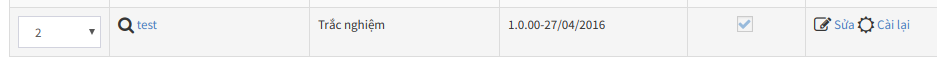

> Đây là quá trình xây dựng các dữ liệu ban đầu, phục vụ cho các tính năng khác của hệ thống. Do đó, bạn không được bỏ qua các thiết lập theo các hướng dẫn trong phần này.
Dữ liệu mẫu là dữ liệu được AZtest nhập sẵn sau khi khởi tạo website, nhằm mục đích giúp người quản trị có cái nhìn tổng quan về website của mình. Bạn cần xóa các dữ liệu này trước khi bắt đầu xây dựng nội dung website.

Để xóa dữ liệu mẫu, thực hiện theo các bước sau đây:

> Hành động này sẽ xóa hết tất cả dữ liệu của module **Trắc nghiệm**, bạn không thể khôi phục lại dữ liệu sau khi đã xóa. Việc này chỉ phù hợp với website mới, cần xóa dữ liệu demo.

- [Đăng nhập khu vực quản trị website](/start/#ang-nhap-khu-vuc-quan-tri)
- Truy cập **Quản lý modules** (menu ngang)
- Trong bảng danh sách module, tìm đến dòng có tên module là **test** (hình) 

  

- Click nút **Cài lại** ở cuối dòng này. Hệ thống sẽ hiển thị hộp thoại nhỏ để xác nhận thêm một lần nữa, click **Thực hiện** để đồng ý xóa.