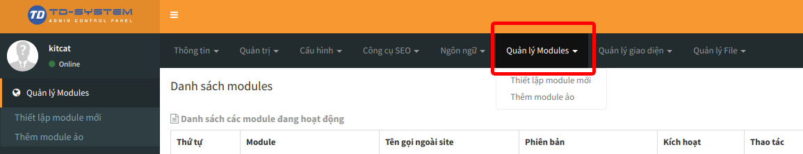
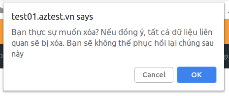

**DỮ LIỆU MẪU là dữ liệu được AZtest nhập sẵn sau khi khởi tạo website, nhằm mục đích giúp người quản trị có cái nhìn tổng quan về website của mình.**

Bạn cần xóa các dữ liệu này trước khi bắt đầu xây dựng nội dung. Đây chính là bước khởi đầu để bạn có thể tạo một đề thi trắc nghiệm hoàn chỉnh.

<iframe width="875" height="398" src="https://www.youtube.com/embed/XFm_WC77pLw" frameborder="0" allow="accelerometer; autoplay; encrypted-media; gyroscope; picture-in-picture" allowfullscreen></iframe>

*
Video hướng dẫn Xóa dữ liệu mẫu trong AZtest
* 
 
> Hành động này sẽ xóa hết tất cả dữ liệu của module Trắc nghiệm, bạn không thể khôi phục lại dữ liệu sau khi đã xóa

Để xóa dữ liệu mẫu, thực hiện theo các bước sau đây:

**BƯỚC 1**:  [Đăng nhập khu vực quản trị website](/start/#ang-nhap-khu-vuc-quan-tri)

**BƯỚC 2**:  Truy cập **Trắc nghiệm** (1) 

**BƯỚC 3**: Từ giao diện danh sách đề thi, Click **Xóa dữ liệu mẫu** (2). Hệ thống sẽ hiển thị hộp thoại xác nhận lại một lần nữa. Nhấn **OK** để đồng ý xóa.

### Tiếp theo

- [Tạo chủ đề](/chu-de/)
