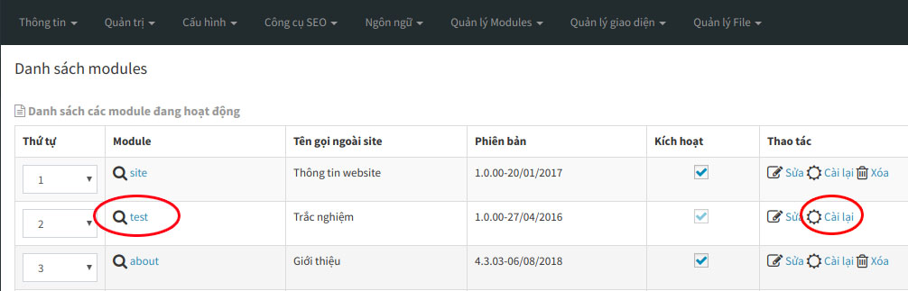

**DỮ LIỆU MẪU là dữ liệu được AZtest nhập sẵn sau khi khởi tạo website, nhằm mục đích giúp người quản trị có cái nhìn tổng quan về website của mình.**

Bạn cần xóa các dữ liệu này trước khi bắt đầu xây dựng nội dung. Đây chính là bước khởi đầu để bạn có thể tạo một đề thi trắc nghiệm hoàn chỉnh.
 
> **Lưu ý** : Hành động này sẽ xóa hết tất cả dữ liệu của module Trắc nghiệm, bạn không thể khôi phục lại dữ liệu sau khi đã xóa. Việc này chỉ phù hợp với website mới, cần xóa dữ liệu demo

Để xóa dữ liệu mẫu, thực hiện theo các bước sau đây:

**BƯỚC 1**:  [Đăng nhập khu vực quản trị website](/start/#ang-nhap-khu-vuc-quan-tri)

**BƯỚC 2**:  Truy cập **Quản lý modules** (menu ngang)

 

**BƯỚC 3**:  Trong bảng danh sách module, tìm đến dòng có tên module là **test** (hình) 

 

Click nút **Cài lại** ở cuối dòng này. Hệ thống sẽ hiển thị hộp thoại nhỏ để xác nhận thêm một lần nữa. Click **Thực hiện** để đồng ý xóa.
 
 

*Sau khi thực hiện bước **Xóa dữ liệu mẫu**, bạn thực hiện tiếp bước [**Tạo chủ đề**](/chu-de/ "Tạo chủ đề").* 